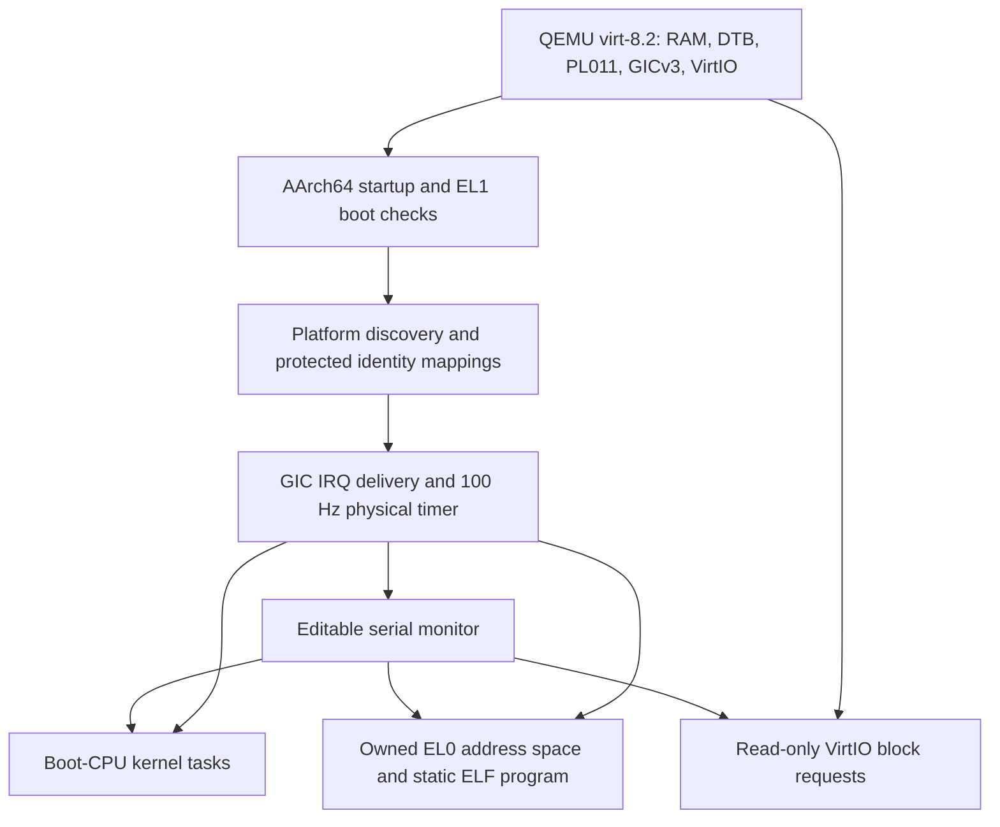
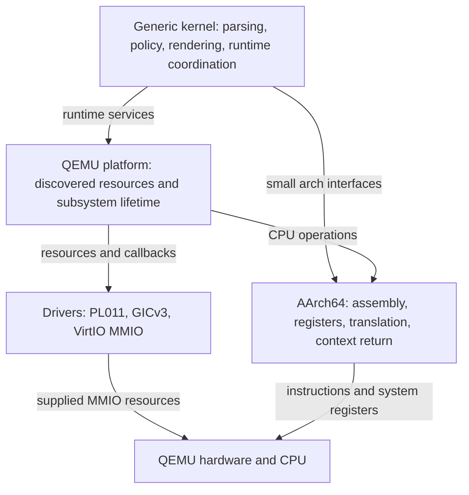

# System documentation

mini-os is a freestanding AArch64 kernel and serial monitor for QEMU
`virt-8.2`. This handbook describes the implemented system. The
[project README](../README.md) contains setup commands and interactive examples;
the [development guide](development.md) explains verification and current limits.

## System at a glance

[Open the SVG](diagrams/system-overview.svg).

Only the boot CPU schedules tasks, executes user programs and owns normal device
work. Enabled secondary CPUs start through PSCI and remain in a bounded,
masked-interrupt heartbeat loop. CPU caches remain disabled.

## Architecture and ownership

[Open the SVG](diagrams/architecture-layers.svg).

This is a responsibility diagram, not a claim that every source file compiles
into an independent library. Platform adapters connect drivers and generic code;
exception entry routes into kernel policy. Raw assembly stays in the architecture
layer. QEMU addresses stay in platform discovery or its early-boot contract.

| Layer | Actual implementation | Responsibility |
| --- | --- | --- |
| Architecture | [src/arch/aarch64](../src/arch/aarch64) | Startup, system registers, vectors, integer contexts, MMU descriptors and DMA barriers |
| Platform | [src/platform/qemu_virt](../src/platform/qemu_virt) | Linker layout, discovery, device routing, allocation ownership and initialization |
| Drivers | [src/drivers](../src/drivers) | PL011 UART, GICv3 MMIO, modern VirtIO block transport |
| Kernel | [src/kernel](../src/kernel) | FDT/ELF parsing, editor, monitor, allocators, scheduling policy and diagnostics |
| User image | [src/user](../src/user) | Freestanding EL0 program and its own linker/startup |
| Host tools | [tools/host/main.cpp](../tools/host/main.cpp) | Native shared-code demonstration |
| Verification | [tests](../tests), [scripts](../scripts) | GoogleTests, fake processes, ELF inspection and QEMU protocols |

## Reading paths

Start with the architecture overview above, then [boot](boot.md) and
[device-tree discovery](device-tree.md) to follow startup. For runtime behavior,
read [console](console.md), [exceptions](exceptions.md),
[interrupts and timekeeping](interrupts-timer.md),
[physical memory and heap](memory.md), and [virtual memory](virtual-memory.md).

For execution, read [CPU discovery and SMP](cpu-smp.md),
[kernel tasks](tasks.md), and [EL0 and ELF loading](user-elf.md).
[VirtIO](virtio.md) explains the DMA and block-I/O path.
[Diagnostics](diagnostics.md) describes inspection and deliberate faults.
[Development and verification](development.md) explains builds, scripts, Docker,
CI, test protocols and diagram maintenance.

Each chapter links implementation files and relevant tests. Capacities and
failure behavior are part of the interface; borrowed spans and callback contexts
must outlive their users.

## Vocabulary

| Term | Meaning here |
| --- | --- |
| Architecture | AArch64 instructions, register access, vectors and page descriptors |
| Platform | QEMU machine resources, linker layout and runtime integration |
| Driver | PL011, GICv3 or VirtIO device operations with supplied resources |
| EL1 / EL0 | Privileged kernel / unprivileged example-program execution |
| DTB / FDT | Flattened device-tree blob / the parser's bounded views |
| SGI / PPI / SPI | Software-generated / per-CPU / shared peripheral interrupt |
| PA / VA | Physical / virtual address; kernel identity mappings use VA = PA |
| IRQ masking | Local CPU serialization; it is not a cross-CPU lock |
| Owned memory | Allocated pages whose release is tied to a subsystem's cleanup |
| Sealed tables | Mapping structures that cannot be extended after sealing |

## Current boundaries

The supported machine is AArch64 on QEMU, with one RAM extent and at most eight
DT CPU records. EL2/EL3 entry transitions, arbitrary boards, cache activation,
SMP scheduling, a general process model, filesystems and block writes are not
implemented. The ELF example is compiled and embedded at build time; there is
no disk-based executable lookup.

Local native, ARM64 Docker and emulated AMD64 verification passes 202 host tests
per configuration and 45 CTests per kernel preset. Actual remote GitHub Actions
verification remains pending. These totals are a verified baseline, not a promise
that a future edit retains the same number of tests.
