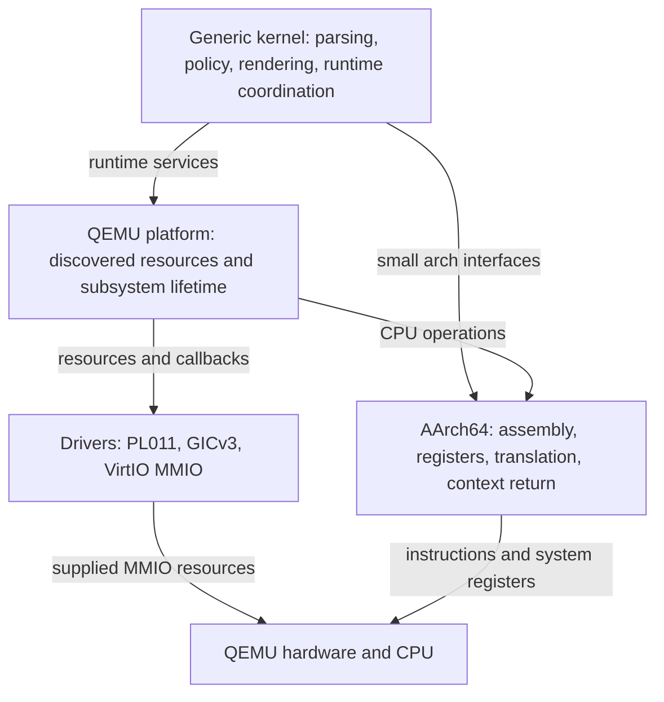

# Architecture and source ownership

[Handbook](README.md) · [Boot](boot.md) · [Development](development.md)

The project supports `ARCH=aarch64` and `PLATFORM=qemu_virt`, selected at build
time. Public interfaces live in `include/mini_os/`. Architecture, platform,
drivers and generic policy have separate implementation owners.

## Layer boundaries

[Open the SVG](diagrams/architecture-layers.svg).

This is a responsibility diagram, not a claim that every source file compiles
into an independent library. Platform adapters connect drivers and generic code;
exception entry routes into kernel policy. Raw assembly stays in the architecture
layer. QEMU addresses stay in platform discovery or its early-boot contract.

| Layer | Actual implementation | Responsibility |
| --- | --- | --- |
| Architecture | [src/arch/aarch64](../src/arch/aarch64) | Startup, system registers, vectors, integer contexts, MMU descriptors and DMA barriers |
| Platform | [src/platform/qemu_virt](../src/platform/qemu_virt) | Linker layout, discovery, device routing, allocation ownership and initialization |
| Drivers | [src/drivers](../src/drivers) | PL011 UART, GICv3 MMIO, modern VirtIO block transport |
| Kernel | [src/kernel](../src/kernel) | FDT/ELF parsing, editor, monitor, allocators, scheduling policy and diagnostics |
| User image | [src/user](../src/user) | Freestanding EL0 program and its own linker/startup |
| Host tools | [tools/host/main.cpp](../tools/host/main.cpp) | Native shared-code demonstration |
| Verification | [tests](../tests), [scripts](../scripts) | GoogleTests, fake processes, ELF inspection and QEMU protocols |

## Compilation and dependency boundaries

[Root CMake](../CMakeLists.txt) builds `mini_os_core`, `mini_os_cpu`,
`mini_os_resources`, `mini_os_pl011`, `mini_os_gic` and `mini_os_virtio`.
`cmake/host.cmake` links the host demo and GoogleTests.
`cmake/kernel.cmake` adds hardware-only implementation and assembly to
`mini_os_kernel`, producing `kernel.elf` and `kernel.map`.

Pure architecture encoders/decoders and platform discovery compile for the host.
MMIO fixtures execute the same driver implementation as the kernel. Sysreg
instructions, startup and exception entry are kernel-only.

Kernel C/C++ uses C17/C++20 without hosted C++ headers, exceptions, RTTI,
implicit runtime initialization or standard-library linkage. Explicit byte/word
loops avoid generated libc dependencies. General-register-only compilation means
task switching does not need to save FP/SIMD state.

## Resource lifetime and serialization

Hardware resources are decoded before their consumers initialize. Device
addresses are supplied to drivers. The DTB window remains reserved and read-only;
FDT views and borrowed compatible strings remain valid while the blob is intact.

The boot CPU owns allocator, queue, scheduler and device state. Foreground
operations and snapshots mask and restore IRQs where required. This protects
against local handlers, not against arbitrary concurrent CPUs. Secondary shared
state uses architecture acquire/release operations.

Private user roots own their table pages and segment pages. VirtIO owns queue
and request pages until a completed device reset makes release safe.
Callbacks borrow both their context and supplied storage; a function-pointer
table does not transfer memory ownership.

## Where a change belongs

A page-allocation policy change belongs in `src/kernel/memory.cpp`; a descriptor
bit change belongs in `src/arch/aarch64/page_tables.cpp`; selecting which physical
interval is device memory belongs in `src/platform/qemu_virt/mappings.cpp`.
Likewise, UART register rules belong in the PL011 driver, while console choice
and IRQ routing belong in the platform.

[AGENTS.md](../AGENTS.md) is the authoritative contributor rule set.
Use small interfaces and focused Conventional Commits. Keep the user-owned
`.gitignore` changes uncommitted.
