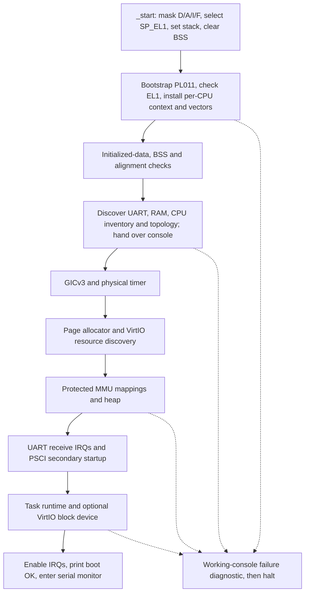
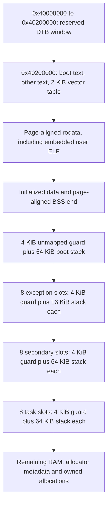

# Boot and linker layout

[Handbook](README.md) · [Device tree](device-tree.md) · [Exceptions](exceptions.md)

## Emulator contract

[The runner](../scripts/qemu.py) shares these arguments between interactive
execution and tests:

```text
-machine virt-8.2,gic-version=3,secure=off,virtualization=off
-cpu cortex-a53 -accel tcg -smp 1 -m 128M
-display none -monitor none -serial stdio -no-reboot
-kernel <kernel.elf>
```

Tests change CPU count/model or RAM only for their named scenarios. Direct ELF
boot uses the ELF entry point. Startup does not depend on a Linux image-protocol
`x0` handoff. The platform finds the DTB at `0x40000000` and bounds it to the
first 2 MiB. Entry must already be at EL1; EL2/EL3 transitions are unsupported.

## Startup order



[Open the SVG](diagrams/boot-sequence.svg).

The complete order is in [kernel_entry](../src/kernel/boot.cpp).
The resource line is emitted during successful console handover; it precedes
later device initialization and the final `mini-os: boot OK`. That success marker
appears only after every required initialization succeeds.

Before discovery, PL011 uses platform constants `0x09000000`, 24 MHz and
115200 baud. A working console prints `mini-os: boot FAIL: <reason>` on
failure and enters the masked halt loop. If bootstrap UART initialization itself
fails, there is no diagnostic channel; the automated runner reports missing output.

## Physical image layout



[Open the SVG](diagrams/boot-memory-layout.svg).

Only the DTB window and image start have fixed addresses. Section boundaries,
stack addresses and image size come from linker symbols; do not copy a current
debug image's addresses into another build.

[The linker script](../src/platform/qemu_virt/kernel.ld) defines RX text/vectors,
R rodata and RW data load segments. BSS and stack reservations are `NOLOAD`.
It rejects constructors, destructors, TLS, RAM overflow, incorrectly aligned
permission boundaries and incorrect vector/stack geometry. The image must fit
the 128 MiB link-time RAM budget even when runtime RAM is 256 MiB.

[start.S](../src/arch/aarch64/boot/start.S) clears BSS in eight-byte stores.
Secondary entry never repeats this shared BSS clear.

## Verification and inspection

[verify_elf.py](../scripts/verify_elf.py) checks architecture, entry, load
segments, permissions, runtime dependencies, vectors, stack geometry and exported
fault/entry symbols. `kernel.boot` requires the exact resource and boot lines.
[Boot runner fixtures](../tests/python/test_boot_runner.py) exercise partial output,
wrong markers, early exit, missing tools, timeout and terminate/kill/reap cleanup.

Related commands: `kernel-build`, `kernel-run` and `kernel-test`.
