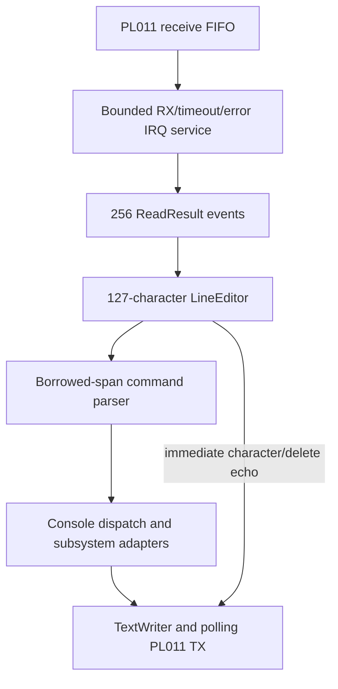
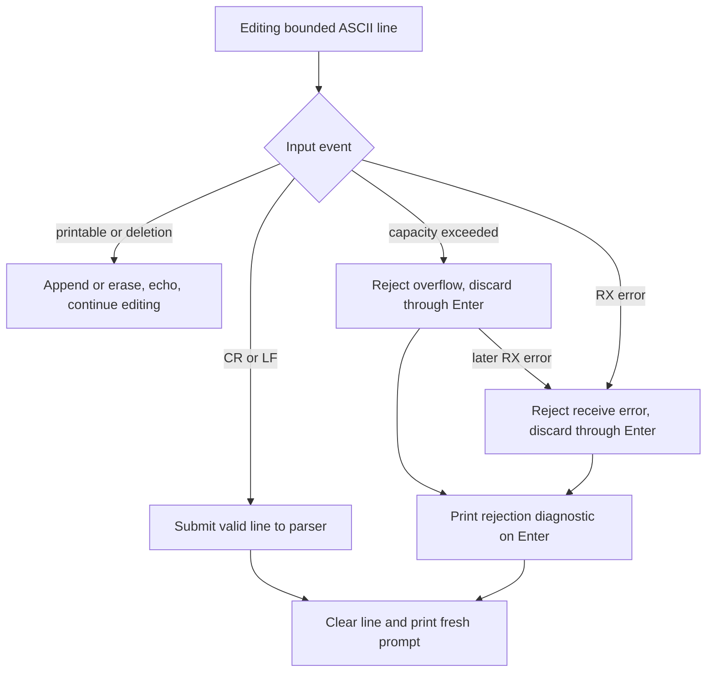

# Serial console and monitor

[Handbook](README.md) · [Interrupts](interrupts-timer.md) · [Diagnostics](diagnostics.md)

## From UART to a command

[Open the SVG](diagrams/console-input.svg).

The driver receives a supplied base/clock configuration. Initialization selects
115200 baud, 8N1, FIFO, RX/TX enabled and DMA disabled. Startup reception is
polling. Normal boot enables RX, receive-timeout and receive-error interrupts;
TX remains polling so early and fatal output share the same path.

`try_read` first checks FIFO availability, then returns `empty`, `byte` or
`error` with the low eight data bits and framing/parity/break/overrun flags.
It clears associated hardware error status. IRQ service performs at most 64 FIFO
reads and clears timeout/error latches before GIC EOI.

## Queue and idle behavior

The IRQ handler pushes events into `serial::ReceiveQueue`. The editor and
command dispatcher run in foreground, never inside the receive handler.
Both queue operations execute with local IRQs masked.

If the 256-event queue fills, queued input is discarded, dropped accounting
increases, an overrun error event is inserted and the new event is retained.
The error cancels the affected editor line through Enter, preventing execution
of a truncated command.

On empty input, the foreground masks IRQs, rechecks queue depth, uses `WFI`
when still empty, and restores the prior mask. The recheck closes the race
between the first empty read and going idle.

## Editing and parser rules

The buffer stores at most 127 printable ASCII bytes plus NUL. Unused bytes need
not be initialized. Backspace (`0x08`) and Delete (`0x7f`) remove one character
and echo `\b \b`; empty deletion does nothing. Unsupported controls and non-ASCII
bytes are ignored. CR and LF submit; LF immediately after CR is suppressed.

Overflow rings one bell, clears the text and rejects input through the next
Enter. A receive error takes precedence over overflow. Recovery prints
`mini-os: line too long` or `mini-os: uart RX error` and a fresh prompt;
rejected text never reaches dispatch.

[Open the SVG](diagrams/line-editor-states.svg).

Commands are lowercase and case-sensitive. Only ASCII spaces separate names and
arguments. Leading spaces are ignored; there is no quoting, expansion, chaining,
history or cursor movement. `echo` skips separator spaces and preserves internal
and trailing argument spaces. Empty and space-only submissions produce a prompt.

## Dispatch and output

The [console adapter](../src/kernel/console.cpp) parses only submitted valid
lines. It supplies platform inventory and live snapshots to renderers, or calls
bounded subsystem self-tests. The complete [command reference](diagnostics.md)
lists side effects, including commands that deliberately halt.

`TextWriter` takes a character sink plus borrowed context, writes NUL-terminated
strings or bounded spans, and formats 64-bit decimal and fixed-width lowercase
hexadecimal values. Platform `early_putc` converts LF to CRLF. Fatal reporting
uses polling transmission and requires a working UART.

## Implementation and verification

| Part | Source | Tests |
| --- | --- | --- |
| Device registers | [PL011](../src/drivers/uart/pl011/pl011.cpp) | [pl011_test](../tests/pl011_test.cpp), [uart_irq_test](../tests/uart_irq_test.cpp) |
| Queue and adapter | [serial_queue](../src/kernel/serial_queue.cpp), [platform console](../src/platform/qemu_virt/console.cpp) | [uart_irq_test](../tests/uart_irq_test.cpp) |
| Editing | [line_editor](../src/kernel/line_editor.cpp) | [line_editor_test](../tests/line_editor_test.cpp) |
| Parsing/rendering | [monitor](../src/kernel/monitor.cpp), [text_writer](../src/kernel/text_writer.cpp) | [monitor_test](../tests/monitor_test.cpp) |

`kernel.uart` preserves editing regressions; `kernel.uart_irq` additionally checks
idle wakeups, bursts and increasing IRQ/queue accounting. Fake-process protocols
test fragmented output, incorrect responses, closed input, deadline and cleanup.
