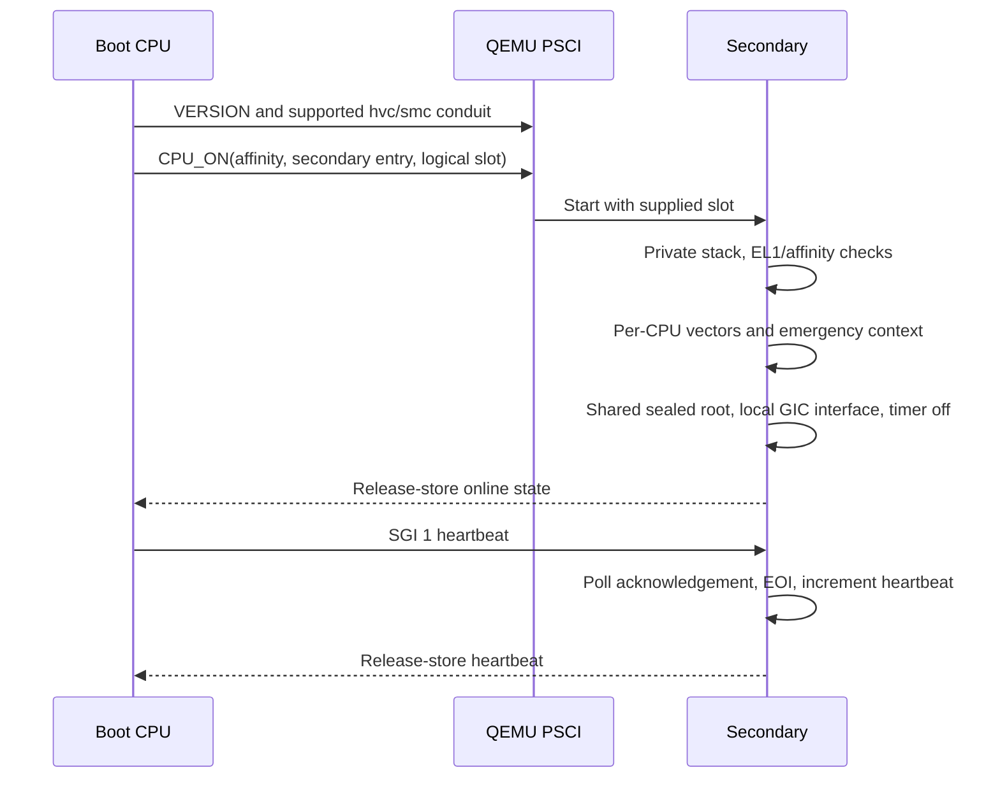
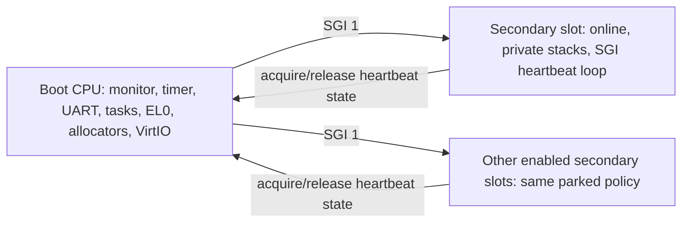

# CPU inventory, topology, features and SMP startup

[Handbook](README.md) · [Device tree](device-tree.md) · [Tasks](tasks.md)

## Inventory and inspection are different

[discover_cpus](../src/platform/qemu_virt/cpus.cpp) keeps at most eight records,
including disabled CPUs. Each carries MPIDR affinity, enabled status, validated
first compatible string and node identity. Records are sorted by affinity.
Exactly one enabled record must match the boot CPU; its inventory index need
not be zero.

The DT description uses `device_type = "cpu"`, one affinity `reg` and supported
cells. Duplicate identities, reserved affinity bits, ambiguous properties or
capacity overflow fail boot. Compatible strings may fall back to `/cpus`;
complete lists are validated and borrow the persistent DTB.

`cpu` samples only the boot CPU's MIDR, MPIDR, CurrentEL, DAIF and SCTLR.
[Pure decoding](../src/arch/aarch64/cpu_decode.cpp) recognizes Cortex-A53/A57 and
preserves numeric fields for unknown identities. DT enabled status is not proof
of online state.

## Optional hierarchy and feature fields

[topology discovery](../src/platform/qemu_virt/topology.cpp) resolves `cpu-map`
phandles into sockets, nested clusters, cores and optional threads. Every inventory
record must be represented unambiguously when a map exists, including disabled
records. Sibling role/index constraints are validated. An absent map is usable;
`topology` reports `described=no` instead of inferring hierarchy from affinity.

`features` reads ID_AA64PFR0, ISAR0, ISAR1, MMFR0, MMFR1 and DFR0 on the boot CPU.
[Feature decoding](../src/arch/aarch64/features_decode.cpp) retains raw fields
while describing exception levels, FP/SIMD, GIC, instruction extensions, address
widths/granules, PAN/HAFDBS/SB and debug resources. Unknown encodings stay unknown.
Reading a feature does not enable it.

## Secondary startup

The [platform SMP adapter](../src/platform/qemu_virt/smp.cpp) gives the boot CPU
logical slot zero, regardless of its inventory index. Enabled secondaries map to
other slots; disabled records stay offline. PSCI uses its supported `hvc` or `smc`
conduit, version query and AArch64 CPU_ON ID `0xc4000003`. Custom legacy IDs and
spin-table startup are unsupported.

[Secondary assembly](../src/arch/aarch64/boot/secondary.S) selects a private
64 KiB guarded stack without clearing shared BSS. Each CPU validates its affinity,
installs its context/vectors, activates the shared immutable identity root and
initializes its redistributor/CPU interface without resetting global GIC state.
Each has a separate guarded 16 KiB exception stack.

## Online but parked

Secondaries keep D/A/I/F masked and their physical timer disabled. They poll
`ICC_IAR1`, use `WFI` on spurious IDs, and consume only SGI 1 with combined EOI.
Unexpected real IDs mark startup/runtime failure and halt that CPU. This masked
acknowledgement path is distinct from the boot CPU's returning IRQ vectors.

Startup and heartbeat verification have bounded two-second counter budgets.
State publication and consumption use architecture acquire/release operations.
`smp` reports actual online count, stacks, saved CPU state and heartbeats;
`smp test` checks new heartbeat delivery. Online does not imply participation
in task scheduling, device IRQ dispatch or allocator operations.

Tests: [CPU](../tests/cpus_test.cpp), [identity](../tests/cpu_decode_test.cpp),
[topology](../tests/topology_test.cpp), [features](../tests/features_test.cpp),
[SMP](../tests/smp_test.cpp), `kernel.cpu_discovery` and `kernel.smp`.
The QEMU suites cover A53/A57 and one/four/eight-CPU configurations where specified.
