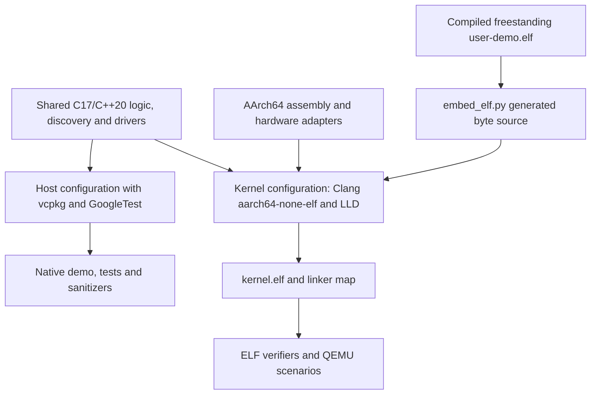
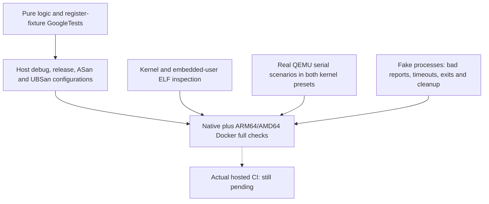

# Development, builds and verification

[Handbook](README.md) · [Architecture](README.md#architecture-and-ownership)

## Build modes and artifacts

The root [CMake configuration](../CMakeLists.txt) selects host or kernel mode.
[CMakePresets.json](../CMakePresets.json) gives each preset an independent build
directory and compilation database.

| Preset | Purpose | Main artifacts |
| --- | --- | --- |
| `host-debug` | Native shared-code demo, GoogleTests and analysis | `mini_os_demo`, `mini_os_tests` |
| `host-release` | Optimized shared code and tests | Same native executables |
| `host-sanitize` | ASan/UBSan host coverage | Same executables with sanitizer runtime |
| `kernel-debug` | Freestanding AArch64 debug kernel | `kernel.elf`, `kernel.map`, `user-demo.elf` |
| `kernel-release` | Optimized freestanding AArch64 kernel | Same target artifacts |



The [cross toolchain](../cmake/toolchains/aarch64-none-elf.cmake) uses CMake
`Generic` and static-library compiler probes. Kernel options exclude hosted
headers/linkage, exceptions, RTTI, stack protector, unwind support, dynamic
initialization and FP/SIMD generation. Strict alignment and general registers
are required. LLD links statically with undefined-symbol checks and the platform
linker script.

Host mode retains native SDK/runtime settings, hosted tests and optional
sanitizers. macOS scripts select Apple's SDK compiler for host sanitizer
compatibility and separately resolve Homebrew LLVM/LLD for kernel work.
Changing a configured compiler requires cleaning that preset.

## Setup and scripts

The [project README](../README.md#prerequisites-and-setup) lists platform package
prerequisites. System packages are installed by the user or CI, never by setup.

```sh
./scripts/setup.sh --kernel
./scripts/dev.sh kernel-build
./scripts/dev.sh kernel-run
./scripts/dev.sh kernel-test kernel-release
```

Kernel setup prepares pinned Python-venv CMake/Ninja tools, checks the AArch64
compiler and versioned QEMU machine, and does not bootstrap hosted libraries.

```sh
./scripts/setup.sh
./scripts/dev.sh check-host
./scripts/dev.sh check
```

Host setup bootstraps vcpkg's exact [manifest baseline](../vcpkg.json).
GoogleTest and `magic_enum` belong to the host-only `tests` feature. Enum reflection
checks every declared FDT, ELF, VirtIO, CPU-discovery and resource-discovery error
for a distinct, nonempty diagnostic. Shared code uses the freestanding
[enum-text helper](../include/mini_os/enum_text.h) with constexpr tables keyed by
explicit enum values; declaration order and gaps do not affect lookup. Compile-time
validation rejects duplicate values and missing labels. Host tests use reflection
over the full eight-bit range to verify coverage and original unknown-value
fallbacks. A supplied external `VCPKG_ROOT` is preserved rather than reset.
Kernel builds do not depend on vcpkg or hosted C++ headers.

[common.sh](../scripts/common.sh) locates the project and tools.
`MINI_OS_BUILD_ROOT` must be an absolute directory other than `/`.
`MINI_OS_VENV` selects the tool environment; `CC/CXX` affect fresh host
configuration. [dev.sh](../scripts/dev.sh) provides configure/build/test/run,
kernel-build/run/test/lint, format/format-check, lint, check-host/check and
preset-specific clean. Defaults are host-debug or kernel-debug as appropriate.

## Docker and CI

[Dockerfile](../Dockerfile) packages Ubuntu 24.04, LLVM/LLD 18, QEMU, pinned
build tools and vcpkg. [Compose](../compose.yaml) binds source read-only for
development and uses a named `state` volume for downloads/caches/builds under
`/var/mini-os`. Builds are separated by container `TARGETARCH`. The formatter
service alone needs a writable source bind; Linux UID/GID can match the host.

```sh
docker compose build dev
docker compose run --rm -T dev check
docker compose run --rm dev kernel-run
./scripts/docker.sh shell
```

The [Docker wrapper](../scripts/docker.sh) supports the development commands,
rebuilds the image and selects formatting ownership. Rebuild after Dockerfile,
pinned tool versions or vcpkg baseline changes. `clean PRESET` removes one build;
`docker compose down --volumes` removes this project's container caches.

[GitHub Actions](../.github/workflows/ci.yml) has an Ubuntu host-quality job,
a debug/release kernel job and native AMD64/ARM64 Docker jobs. The jobs invoke
the same development commands, so newly registered CTests are inherited.
Checkout is SHA-pinned and workflow permissions are read-only.
Local AMD64 Docker verification is emulated on ARM64 macOS; it is not proof
of an actual hosted Actions run. Remote CI remains unverified.

## Quality and test layers

[quality.py](../scripts/quality.py) formats project C/C++ headers/sources and
uses each build's `compile_commands.json` for clang-tidy. It excludes downloaded
dependencies and assembly units. [.clang-format](../.clang-format),
[.clang-tidy](../.clang-tidy), [.editorconfig](../.editorconfig) and
[.gitattributes](../.gitattributes) define shared formatting/editor conventions.



Host fixtures test bounded/malformed parser input, decoding, allocator policy,
scheduler transitions, exact rendering and driver register decisions. Shared
[alignment.c](../src/kernel/alignment.c) is a C ABI utility validating power-of-two
alignment and overflow without changing output on failure. Its host tests and
the boot check exercise the same implementation.

The QEMU runner continuously drains serial stdout and emulator stderr, sends
incremental input, matches fresh ordered responses and preserves diagnostics
on failure. Normal protocols reject boot failures and unexpected exception
markers. Fatal scenarios first require readiness, verify complete context/halt
and require the emulator to remain alive without another prompt.

Each QEMU action defaults to one ten-second overall deadline; registered serial
and fake-process CTests have twenty-second outer timeouts. Scenario groups share
their action's deadline. Normal MMU and MMU fault checks are separate groups.
Cleanup terminates, waits, escalates to kill after one second and always reaps.
Ctrl-C uses the same cleanup path for interactive execution.

## CTest coverage map

| Runtime CTest | Main coverage |
| --- | --- |
| `kernel.boot` / `kernel.uart` / `kernel.fdt` | Exact boot/resources, editing and invalid DTB |
| `kernel.monitor` / `kernel.cpu_discovery` | Commands, identity/state, hierarchy/features |
| `kernel.exception` / `kernel.recovery` | Fatal context, emergency stack and exact armed recovery |
| `kernel.irq` / `kernel.timer` | Returning SGIs, context and timer progress |
| `kernel.memory` / `kernel.heap` | Pages, reservations, reclamation and arena integrity |
| `kernel.mmu` / `kernel.mmu_fault` | Permissions/identity and fatal data-abort context |
| `kernel.uart_irq` | Delivery, queue errors/bursts and idle wakeups |
| `kernel.performance` | Coherent diagnostics and bounded workload accounting |
| `kernel.smp` / `kernel.tasks` | Parked secondaries, heartbeat, preemption and task lifecycle |
| `kernel.user` / `kernel.elf_loader` | EL0 protection/deadlines, compiled image and rollback |
| `kernel.virtio` | Read-only block data/IRQ completion and transport rejection |
| `kernel.elf` / `kernel.user_elf` | Linked layout/runtime constraints and exact user embedding |

Separate `tools.*_runner` CTests exercise each protocol with fake children,
including normal/fault MMU modules and DTB-editor/user-image utilities.
See [kernel CMake](../cmake/kernel.cmake) for the authoritative registration list
and [tests/python](../tests/python) for fixtures.

## Inspecting a result

```sh
ctest --test-dir build/kernel-debug --output-on-failure -R '^kernel\.virtio$'
python3 scripts/verify_elf.py build/kernel-debug/kernel.elf
python3 scripts/verify_user_elf.py build/kernel-debug/kernel.elf build/kernel-debug/user-demo.elf
python3 scripts/qemu.py mmu-fault-test --image build/kernel-debug/kernel.elf
```

Use the corresponding custom/container build root when applicable.
[verify_elf.py](../scripts/verify_elf.py) checks target ELF layout/runtime symbols;
[verify_user_elf.py](../scripts/verify_user_elf.py) checks user segments/embedding.
[fdt_edit.py](../scripts/fdt_edit.py) and [embed_elf.py](../scripts/embed_elf.py)
produce bounded test/build artifacts rather than hosted kernel dependencies.

The verified local baseline is 220 host tests per configuration and 45 CTests
per kernel preset, passing native macOS, ARM64 Docker and emulated AMD64 Docker.
A green fake-process fixture alone does not prove hardware behavior; a compiled
kernel alone does not prove boot.

## Maintaining these guides and diagrams

Diagrams are maintained as Mermaid blocks in the Markdown guides and display
in viewers with Mermaid support. Each block includes a unique
`%% diagram: name` comment. SVG exports are optional local artifacts.

The optional [diagram tool](../scripts/doc_diagrams.py) can render SVGs when an
export is needed. Install Mermaid CLI 11.12.0 in a temporary directory or use an
existing installation, then supply its `mmdc` executable. It is not a kernel,
host-build or CI dependency:

```sh
npm install --prefix /tmp/mini-os-diagrams --no-audit --no-fund @mermaid-js/mermaid-cli@11.12.0
python3 scripts/doc_diagrams.py --mmdc /tmp/mini-os-diagrams/node_modules/.bin/mmdc
```

After rendering all diagrams, check the local exports with only Python:

```sh
python3 scripts/doc_diagrams.py --check
```

Add `--diagram name` to update one export after the initial full render; the
freshness check still covers every export. If using an already installed Chrome
instead of bundled Chromium, pass `--puppeteer-config /path/to/config.json`
with its `executablePath`. The [Mermaid CLI documentation](https://github.com/mermaid-js/mermaid-cli/blob/master/docs/already-installed-chromium.md)
describes that configuration.

When interfaces change, update the guide and Mermaid blocks and validate links.
Distinguish implemented behavior from unimplemented features. Use focused
Conventional Commits; leave `.gitignore` untouched.
