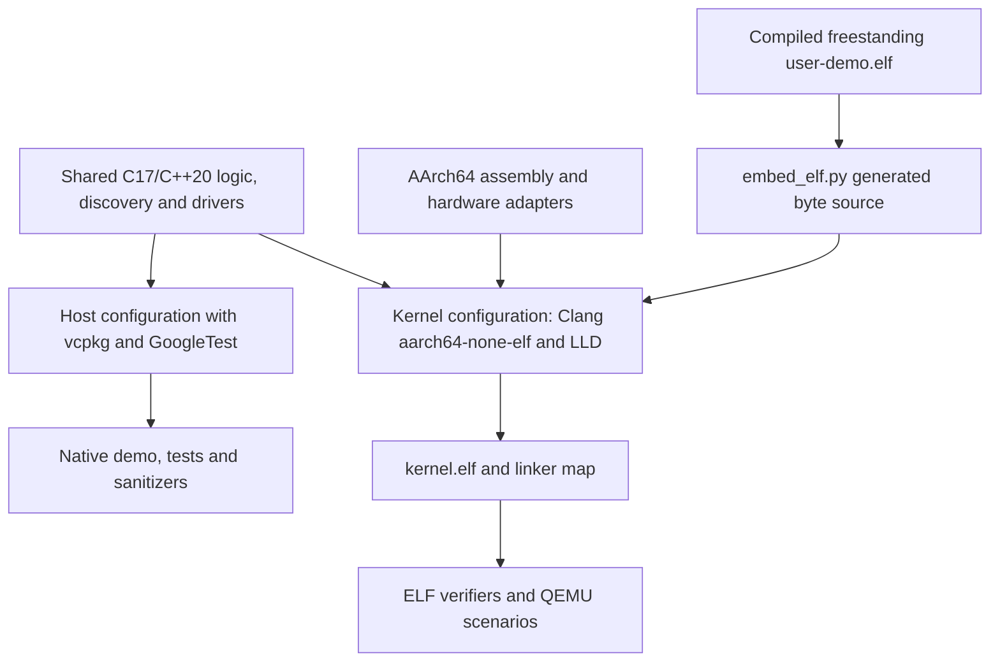
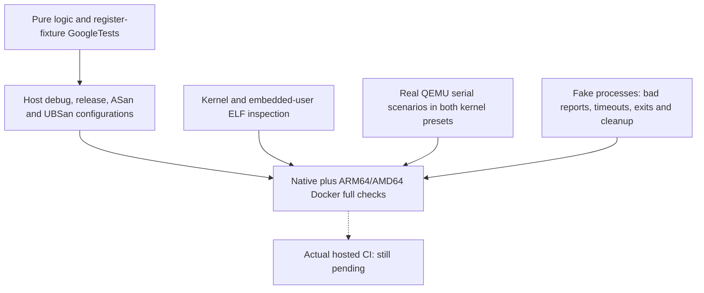

# Development, builds and verification

[Handbook](README.md) · [Architecture](README.md#architecture-and-ownership)

## Build modes and artifacts

The root [CMake configuration](../CMakeLists.txt) selects host or kernel mode.
[CMakePresets.json](../CMakePresets.json) gives each preset an independent build
directory and compilation database.

| Preset | Purpose | Main artifacts |
| --- | --- | --- |
| `host-debug` | Native shared-code demo, GoogleTests and analysis | `mini_os_demo`, `mini_os_tests` |
| `host-release` | Optimized shared code and tests | Same native executables |
| `host-sanitize` | ASan/UBSan host coverage | Same executables with sanitizer runtime |
| `kernel-debug` | Freestanding AArch64 debug kernel | `kernel.elf`, `kernel.map`, `user-demo.elf` |
| `kernel-release` | Optimized freestanding AArch64 kernel | Same target artifacts |



The [cross toolchain](../cmake/toolchains/aarch64-none-elf.cmake) uses CMake
`Generic` and static-library compiler probes. Kernel options exclude hosted
headers/linkage, exceptions, RTTI, stack protector, unwind support, dynamic
initialization and FP/SIMD generation. Strict alignment and general registers
are required. LLD links statically with undefined-symbol checks and the platform
linker script.

Host mode retains native SDK/runtime settings, hosted tests and optional
sanitizers. macOS scripts select Apple's SDK compiler for host sanitizer
compatibility and separately resolve Homebrew LLVM/LLD for kernel work.
Changing a configured compiler requires cleaning that preset.

## Setup and scripts

Run the commands below from the repository directory. System packages are
installed by the user or CI, never by setup.

### Prerequisites and setup

Use Bash, Git, Python 3.9+, and your platform's development tools. Setup installs
pinned CMake and Ninja into the project's `.venv/`. It never installs system
packages. LLVM provides formatting and static analysis tools.

On macOS, install Xcode Command Line Tools and the kernel tools:

```sh
xcode-select --install
brew install llvm@21 lld@21 qemu
```

On Ubuntu 24.04 (the CI configuration):

```sh
sudo apt-get update
sudo apt-get install clang-18 lld-18 llvm-18 clang-format-18 clang-tidy-18 qemu-system-arm git python3-venv curl zip unzip tar pkg-config
export PATH="/usr/lib/llvm-18/bin:$PATH"
```

For kernel development alone:

```sh
./scripts/setup.sh --kernel
./scripts/dev.sh kernel-test
./scripts/dev.sh kernel-run
```

Kernel setup checks Clang's AArch64 target, LLD, LLVM archive tools, and QEMU's
`virt-8.2` machine. It does not clone vcpkg or download hosted libraries. QEMU
must be version 8.2 or newer with the `virt-8.2` model available.

To also prepare the host test environment:

```sh
./scripts/setup.sh
./scripts/dev.sh check
./scripts/dev.sh run
```

Host setup clones vcpkg into `.tools/vcpkg/`, checks out the manifest baseline,
and bootstraps it. The first host configure installs GoogleTest and `magic_enum`
for host tests.
Network access is needed for local build-tool installation and initial hosted
dependencies. Generated files and downloaded tools stay out of Git.

Set `VCPKG_ROOT` before host setup to reuse an existing compatible vcpkg checkout.
Setup preserves its revision; the manifest baseline still pins dependencies.

### Commands and presets

| Command | Action |
| --- | --- |
| `./scripts/setup.sh` | Prepare local build tools and host vcpkg |
| `./scripts/setup.sh --kernel` | Prepare local build tools and validate kernel prerequisites |
| `./scripts/dev.sh configure` | Configure host CMake and dependencies |
| `./scripts/dev.sh build` | Configure and build host targets |
| `./scripts/dev.sh test` | Build and run host GoogleTest tests |
| `./scripts/dev.sh run` | Build and run the native host demo |
| `./scripts/dev.sh kernel-build` | Produce `build/kernel-debug/kernel.elf` and `kernel.map` |
| `./scripts/dev.sh kernel-run` | Build and launch the serial console; Ctrl-C stops QEMU |
| `./scripts/dev.sh kernel-test` | Build and run all kernel CTests, including task workloads, ELF inspection and runner failure checks |
| `./scripts/dev.sh kernel-lint` | Analyze kernel C/C++ with its compilation database |
| `./scripts/dev.sh format` | Format project C/C++ sources and headers |
| `./scripts/dev.sh format-check` | Check formatting without edits |
| `./scripts/dev.sh lint` | Build and analyze host translation units |
| `./scripts/dev.sh check-host` | Formatting, host analysis, debug/release/sanitizer tests |
| `./scripts/dev.sh check` | Run full host checks and kernel analysis/tests in both kernel presets |
| `./scripts/dev.sh clean PRESET` | Remove only that preset's build directory |

Host commands default to `host-debug`; kernel commands default to
`kernel-debug`. Build commands accept an appropriate preset as their second
argument. All five presets have separate build directories:

```sh
./scripts/dev.sh test host-release
./scripts/dev.sh test host-sanitize
./scripts/dev.sh kernel-test kernel-release
./scripts/dev.sh clean kernel-debug
```

Scripts work from any directory. Set `MINI_OS_BUILD_ROOT` to an absolute directory
to keep scripted builds elsewhere, and `MINI_OS_VENV` to reuse a prepared tool
venv. Direct CMake presets still default to `build/`. On macOS, host builds use Apple's SDK Clang so
its sanitizer runtime matches the OS. Set `CC` / `CXX` before the first host
configure to override this. Kernel commands resolve Homebrew `llvm@21` and
`lld@21` separately, ignoring host compiler and SDK environment settings.
On Linux, expose the desired LLVM toolchain on `PATH`. Clean a preset before
changing its compiler. Each build exports `compile_commands.json` for editors
and static analysis; assembly translation units are excluded from clang-tidy.

For direct CMake / IDE use, expose the tools first:

```sh
export PATH="$PWD/.venv/bin:$PATH"
export VCPKG_ROOT="$PWD/.tools/vcpkg"
# On macOS, use these paths for kernel presets:
export PATH="$(brew --prefix llvm@21)/bin:$(brew --prefix lld@21)/bin:$PATH"
cmake --preset kernel-debug
cmake --build --preset kernel-debug
ctest --preset kernel-debug
```

For fresh direct host configuration on macOS, set `CC="$(xcrun --find clang)"`
and `CXX="$(xcrun --find clang++)"`. Use an ignored `CMakeUserPresets.json` for
machine-specific IDE settings.

### Host test dependencies

Host setup bootstraps vcpkg's exact [manifest baseline](../vcpkg.json).
GoogleTest and `magic_enum` belong to the host-only `tests` feature. Enum reflection
checks every declared FDT, ELF, VirtIO, CPU-discovery and resource-discovery error
for a distinct, nonempty diagnostic. Shared code uses the freestanding
[enum-text helper](../include/mini_os/enum_text.h) with constexpr tables keyed by
explicit enum values; declaration order and gaps do not affect lookup. Compile-time
validation rejects duplicate values and missing labels. Host tests use reflection
over the full eight-bit range to verify coverage and original unknown-value
fallbacks. A supplied external `VCPKG_ROOT` is preserved rather than reset.
Kernel builds do not depend on vcpkg or hosted C++ headers.

## Docker and CI

### Docker workflow

Install [Docker Desktop](https://docs.docker.com/desktop/) on macOS or Windows
(using Linux containers), or Docker Engine with Compose v2 on Linux. These
commands work directly in PowerShell as well as a Unix shell; native LLVM,
Python, CMake, vcpkg, and QEMU installations are unnecessary:

```sh
docker compose build dev
docker compose run --rm dev check
docker compose run --rm dev kernel-run
```

The image includes Ubuntu 24.04, LLVM / LLD 18, QEMU, the pinned CMake / Ninja
versions, and vcpkg at the manifest baseline. It builds for the Docker engine's
native `linux/amd64` or `linux/arm64` architecture. The kernel target remains
AArch64 on QEMU `virt-8.2`; TCG emulation needs no KVM device or privileged mode.

Pass any existing development command and preset to the `dev` service:

```sh
docker compose run --rm dev check-host
docker compose run --rm dev test host-sanitize
docker compose run --rm dev kernel-test kernel-release
docker compose run --rm dev kernel-lint
docker compose run --rm dev run
docker compose run --rm dev clean kernel-debug
```

Source changes on the host are immediately visible in the container. The `dev`
service mounts source read-only; project builds, downloads, and vcpkg binary caches
persist in a Compose volume under `/var/mini-os`. Build directories are separated
by container CPU architecture. Native `.venv/`, `.tools/`, and `build/` are never
used as container tools or build outputs. Rebuild the image after changing
`Dockerfile`, `scripts/requirements.txt`, or the vcpkg baseline.

Formatting uses a separate service with a writable source mount:

```sh
docker compose run --rm format
```

On Linux, match your file ownership when formatting:

```sh
LOCAL_UID="$(id -u)" LOCAL_GID="$(id -g)" docker compose run --rm format
```

The Bash wrapper offers the same commands, rebuilds the image when necessary,
and selects the correct Linux formatter UID / GID automatically:

```sh
./scripts/docker.sh check
./scripts/docker.sh kernel-run
./scripts/docker.sh kernel-test kernel-release
./scripts/docker.sh format
./scripts/docker.sh shell
```

For noninteractive automation, add `-T` to `docker compose run`. To open a shell
directly, use `docker compose run --rm --entrypoint bash dev -i`. The shell's
`MINI_OS_BUILD_ROOT` points to the container build directories. `clean PRESET`
removes just that build; `docker compose down --volumes` deletes all Docker
builds and dependency caches for this Compose project. Native builds are kept.

The image also contains a source snapshot for use without Compose or a bind
mount: `docker run --rm --init mini-os-dev:local check`. Compose is preferred for
ongoing development because it uses current source and retains caches.
The full workflow is verified locally in both ARM64 and AMD64 containers on
macOS Docker Desktop; the AMD64 check uses local emulation. CI builds the image
and runs the same workflow on native AMD64 and ARM64 Linux runners. An actual
remote Actions run is still pending. To reproduce AMD64 verification on an ARM64
Docker Desktop machine, use emulation explicitly:

```sh
docker buildx build --platform linux/amd64 --load -t mini-os-dev:amd64 .
docker run --rm --init --platform linux/amd64 mini-os-dev:amd64 check
```

This uses the image's source snapshot and fresh build directories; emulated host
builds and analysis are slower than native ARM64 checks.

### GitHub Actions

[GitHub Actions](../.github/workflows/ci.yml) has an Ubuntu host-quality job,
a debug/release kernel job and native AMD64/ARM64 Docker jobs. The jobs invoke
the same development commands, so newly registered CTests are inherited.
Checkout is SHA-pinned and workflow permissions are read-only.
Local AMD64 Docker verification is emulated on ARM64 macOS; it is not proof
of an actual hosted Actions run. Remote CI remains unverified.

## Quality and test layers

[quality.py](../scripts/quality.py) formats project C/C++ headers/sources and
uses each build's `compile_commands.json` for clang-tidy. It excludes downloaded
dependencies and assembly units. [.clang-format](../.clang-format),
[.clang-tidy](../.clang-tidy), [.editorconfig](../.editorconfig) and
[.gitattributes](../.gitattributes) define shared formatting/editor conventions.



Host fixtures test bounded/malformed parser input, decoding, allocator policy,
scheduler transitions, exact rendering and driver register decisions. Shared
[alignment.c](../src/kernel/alignment.c) is a C ABI utility validating power-of-two
alignment and overflow without changing output on failure. Its host tests and
the boot check exercise the same implementation.

The QEMU runner continuously drains serial stdout and emulator stderr, sends
incremental input, matches fresh ordered responses and preserves diagnostics
on failure. Normal protocols reject boot failures and unexpected exception
markers. Fatal scenarios first require readiness, verify complete context/halt
and require the emulator to remain alive without another prompt.

Each QEMU action defaults to one ten-second overall deadline; registered serial
and fake-process CTests have twenty-second outer timeouts. Scenario groups share
their action's deadline. Normal MMU and MMU fault checks are separate groups.
Cleanup terminates, waits, escalates to kill after one second and always reaps.
Ctrl-C uses the same cleanup path for interactive execution.

## CTest coverage map

| Runtime CTest | Main coverage |
| --- | --- |
| `kernel.boot` / `kernel.uart` / `kernel.fdt` | Exact boot/resources, editing and invalid DTB |
| `kernel.monitor` / `kernel.cpu_discovery` | Commands, identity/state, hierarchy/features |
| `kernel.exception` / `kernel.recovery` | Fatal context, emergency stack and exact armed recovery |
| `kernel.irq` / `kernel.timer` | Returning SGIs, context and timer progress |
| `kernel.memory` / `kernel.heap` | Pages, reservations, reclamation and arena integrity |
| `kernel.mmu` / `kernel.mmu_fault` | Permissions/identity and fatal data-abort context |
| `kernel.uart_irq` | Delivery, queue errors/bursts and idle wakeups |
| `kernel.performance` | Coherent diagnostics and bounded workload accounting |
| `kernel.smp` / `kernel.tasks` | Parked secondaries, heartbeat, preemption and task lifecycle |
| `kernel.user` / `kernel.elf_loader` | EL0 protection/deadlines, compiled image and rollback |
| `kernel.virtio` | Read-only block data/IRQ completion and transport rejection |
| `kernel.elf` / `kernel.user_elf` | Linked layout/runtime constraints and exact user embedding |

Separate `tools.*_runner` CTests exercise each protocol with fake children,
including normal/fault MMU modules and DTB-editor/user-image utilities.
See [kernel CMake](../cmake/kernel.cmake) for the authoritative registration list
and [tests/python](../tests/python) for fixtures.

## Inspecting a result

```sh
ctest --test-dir build/kernel-debug --output-on-failure -R '^kernel\.virtio$'
python3 scripts/verify_elf.py build/kernel-debug/kernel.elf
python3 scripts/verify_user_elf.py build/kernel-debug/kernel.elf build/kernel-debug/user-demo.elf
python3 scripts/qemu.py mmu-fault-test --image build/kernel-debug/kernel.elf
```

Use the corresponding custom/container build root when applicable.
[verify_elf.py](../scripts/verify_elf.py) checks target ELF layout/runtime symbols;
[verify_user_elf.py](../scripts/verify_user_elf.py) checks user segments/embedding.
[fdt_edit.py](../scripts/fdt_edit.py) and [embed_elf.py](../scripts/embed_elf.py)
produce bounded test/build artifacts rather than hosted kernel dependencies.

The verified local baseline is 220 host tests per configuration and 45 CTests
per kernel preset, passing native macOS, ARM64 Docker and emulated AMD64 Docker.
A green fake-process fixture alone does not prove hardware behavior; a compiled
kernel alone does not prove boot.

## Maintaining these guides and diagrams

Diagrams are maintained as Mermaid blocks in the Markdown guides and display
in viewers with Mermaid support. Each block includes a unique
`%% diagram: name` comment. SVG exports are optional local artifacts.

The optional [diagram tool](../scripts/doc_diagrams.py) can render SVGs when an
export is needed. Install Mermaid CLI 11.12.0 in a temporary directory or use an
existing installation, then supply its `mmdc` executable. It is not a kernel,
host-build or CI dependency:

```sh
npm install --prefix /tmp/mini-os-diagrams --no-audit --no-fund @mermaid-js/mermaid-cli@11.12.0
python3 scripts/doc_diagrams.py --mmdc /tmp/mini-os-diagrams/node_modules/.bin/mmdc
```

After rendering all diagrams, check the local exports with only Python:

```sh
python3 scripts/doc_diagrams.py --check
```

Add `--diagram name` to update one export after the initial full render; the
freshness check still covers every export. If using an already installed Chrome
instead of bundled Chromium, pass `--puppeteer-config /path/to/config.json`
with its `executablePath`. The [Mermaid CLI documentation](https://github.com/mermaid-js/mermaid-cli/blob/master/docs/already-installed-chromium.md)
describes that configuration.

When interfaces change, update the guide and Mermaid blocks and validate links.
Distinguish implemented behavior from unimplemented features. Use focused
Conventional Commits; leave `.gitignore` untouched.
