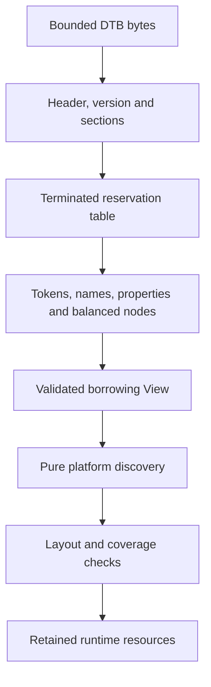

# Device-tree parsing and resource discovery

[Handbook](README.md) · [Boot](boot.md) · [Memory](memory.md) · [CPU/SMP](cpu-smp.md)

## Parser contract

[`fdt::View`](../include/mini_os/fdt.h) borrows a bounded byte span. `open`
validates the complete supported tree before lookups expose it. Big-endian
integers are decoded bytewise, so unaligned input buffers are accepted.
There is no allocation, recursion or implicit libc dependency.

Validation covers magic, total size, version-17-compatible layout, section bounds,
alignment/overlap, reservation termination, property names/string offsets,
balanced nodes and final end token. `Cursor` carries a fixed 32-node stack.
Lookups return explicit `Error` values; absent, invalid and ambiguous are distinct.

| API | Use |
| --- | --- |
| `View::next` | Iterative node/property events with parent identity |
| `find_node` / `parent` | Absolute paths and ancestry |
| `property` | Borrowed property bytes; duplicate matches are ambiguous |
| `find_phandle` | Unambiguous referenced node lookup |
| `next_reservation` | Enumerate reservation-table extents |
| `Bytes::u32/u64` | Bounded big-endian scalars |
| `Bytes::string/string_index` | Validate strings and full string lists |

A node ID is an offset identity within this blob, not a permanent pointer to a
newly allocated node object. Keep bytes alive and unchanged for all views and
borrowed CPU compatible strings.

## Supported resource shapes

[Shared FDT helpers](../src/platform/qemu_virt/fdt_helpers.cpp) implement enabled
status, cells, compatibility and `reg` decoding. Status missing, `ok` or `okay`
means enabled. Discovery rejects unsupported layouts instead of inventing
translations.

| Resource | Supported description | Main implementation |
| --- | --- | --- |
| Console | `/chosen/stdout-path`, absolute path or `/aliases`, optional parameters stripped; enabled root PL011 | [resources.cpp](../src/platform/qemu_virt/resources.cpp) |
| UART clock | `uartclk` clock-name/phandle to enabled `fixed-clock`, zero clock cells, nonzero 32-bit frequency | [resources.cpp](../src/platform/qemu_virt/resources.cpp) |
| RAM | One enabled root memory node, one extent, one/two address and size cells | [resources.cpp](../src/platform/qemu_virt/resources.cpp) |
| CPUs | `/cpus`, one/two address cells, zero size cells, direct CPU children, one affinity each | [cpus.cpp](../src/platform/qemu_virt/cpus.cpp) |
| Hierarchy | Optional `cpu-map` sockets/clusters/cores/threads and unique CPU phandles | [topology.cpp](../src/platform/qemu_virt/topology.cpp) |
| GIC | One enabled root `arm,gic-v3`, distributor and one redistributor region, three interrupt cells | [gic.cpp](../src/platform/qemu_virt/gic.cpp) |
| Timer | Enabled `arm,armv8-timer`, nonsecure physical PPI selected by `phys` name or binding order | [timer_resources.cpp](../src/platform/qemu_virt/timer_resources.cpp) |
| UART IRQ | Chosen PL011's level-triggered SPI through selected GIC | [uart_resources.cpp](../src/platform/qemu_virt/uart_resources.cpp) |
| Reserved memory | Reservation-table entries and enabled static root-translated reserved-memory children | [memory_resources.cpp](../src/platform/qemu_virt/memory_resources.cpp) |
| PSCI | Enabled root provider, `hvc` or `smc`, PSCI enable-method on enabled secondaries | [smp_resources.cpp](../src/platform/qemu_virt/smp_resources.cpp) |
| VirtIO | At most 32 enabled root MMIO nodes, one extent and edge-rising or level-high SPI each | [virtio_resources.cpp](../src/platform/qemu_virt/virtio_resources.cpp) |

Interrupt discovery supports inherited `interrupt-parent` and supported
`interrupts-extended` descriptions, with conflicting or mismatched providers
rejected. CPU inventory includes disabled CPUs and sorts by affinity.
Address arithmetic and register coverage are checked before touching resources.

## Coverage and lifetime

RAM must contain the reserved DTB window and full linked image, including every
stack reservation. UART, GIC and VirtIO MMIO pages must not alias RAM, protected
holes or each other under incompatible mappings.

The DTB window stays reserved and read-only. `mem reclaim` releases supported
reusable external reservations; it does not release the DTB window.
`PlatformResources`, CPU/topology inventory, GIC and VirtIO records retain
validated results for runtime use.

## Verification

Parser fixtures: [fdt_test.cpp](../tests/fdt_test.cpp).
Discovery fixtures: [resources](../tests/resources_test.cpp),
[CPUs](../tests/cpus_test.cpp), [topology](../tests/topology_test.cpp),
[GIC](../tests/gic_test.cpp), [timer](../tests/timer_test.cpp),
[memory](../tests/memory_test.cpp), [UART](../tests/uart_irq_test.cpp),
[SMP](../tests/smp_test.cpp) and [VirtIO](../tests/virtio_test.cpp).

`kernel.fdt` checks normal 128 MiB discovery, 256 MiB discovery with serial
exchanges and corrupted magic rejection. [fdt_edit.py](../scripts/fdt_edit.py)
provides bounded test-fixture transformations for reservation tests; it is not
a kernel runtime dependency.
