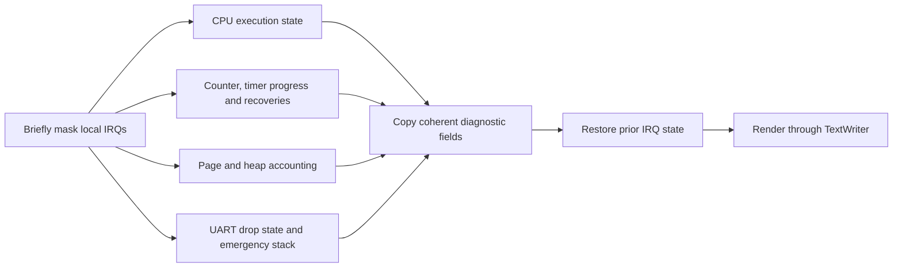

# Monitor commands and diagnostics

[Handbook](README.md) · [Console](console.md) · [Exceptions](exceptions.md)

The monitor is an inspection and bounded-test interface. Commands are parsed by
[monitor.cpp](../src/kernel/monitor.cpp) and integrated in
[console.cpp](../src/kernel/console.cpp). Invalid arguments produce a usage line
and fresh prompt. Except for explicitly fatal commands, the normal result ends
at `mini-os> `.

## Complete command reference

| Command | Effect | Guide |
| --- | --- | --- |
| `help` | Lists the exact supported commands | [Console](console.md) |
| `echo [text]` | Echoes text with internal/trailing spaces | [Console](console.md) |
| `cpu` | Boot identity/register state and DT inventory | [CPU/SMP](cpu-smp.md) |
| `topology` | Validated DT hierarchy; no inferred hierarchy | [CPU/SMP](cpu-smp.md) |
| `features` | Raw/decoded boot CPU feature fields | [CPU/SMP](cpu-smp.md) |
| `smp [test]` | Online/heartbeat inspection or secondary SGI verification | [CPU/SMP](cpu-smp.md) |
| `tasks [test]` | Scheduler inspection or three-worker lifecycle test | [Tasks](tasks.md) |
| `user [test]` | Built-in EL0 example or eight execution/fault cases | [EL0/ELF](user-elf.md) |
| `elf [test]` | Compiled embedded ELF, optionally repeated with rejection test | [EL0/ELF](user-elf.md) |
| `virtio [test]` | Block state or bounded read-only sector checks | [VirtIO](virtio.md) |
| `mmu` | Translation registers and permission probes | [Virtual memory](virtual-memory.md) |
| `mem [test\|reclaim]` | Page stats, allocate/release probe or reusable-region reclamation | [Memory](memory.md) |
| `heap [test]` | Heap stats or fragmentation/coalescing probe | [Memory](memory.md) |
| `uart` | RX delivery/error/drop/queue/idle counters | [Console](console.md) |
| `irq [test]` | GIC counters or boot self-SGI/context probe | [Interrupts](interrupts-timer.md) |
| `timer` | Frequency, interval, counter, ticks and missed periods | [Timer](interrupts-timer.md) |
| `diag` | Coherent state/resource snapshot | This page |
| `perf [test]` | Last result or bounded physical-memory workload | This page |
| `recover brk` / `recover undef` | Exact armed recovery/context test | [Exceptions](exceptions.md) |
| `fault brk` / `fault undef` | Deliberate fatal breakpoint/undefined exception | [Exceptions](exceptions.md) |
| `fault unmapped` / `fault readonly` | Deliberate fatal translation/permission abort | [Exceptions](exceptions.md) |
| `fault stack` | Deliberate guarded-SP fault on emergency stack | [Exceptions](exceptions.md) |

The `[test]` spelling is documentation syntax for an optional literal argument;
do not type brackets. `mem` accepts at most one of `test` or `reclaim`.
`fault` and `recover` require a supported argument. These commands do not parse
user-supplied addresses, load arbitrary files or expose memory-write primitives.

## Snapshot meanings

[Open the SVG](diagrams/diagnostic-snapshot.svg).

`diag` reports EL, MMU/cache/foreground IRQ state, uptime microseconds, timer
ticks/missed periods, controlled recovery count, UART dropped events, free pages,
free heap payload and emergency-stack top. The snapshot reports the caller's
original DAIF state rather than the temporary masked state used while sampling.

Uptime starts when diagnostics initialize after vector installation, not at
QEMU process launch. [counter_microseconds](../src/kernel/performance.cpp) uses
modular elapsed counts below `2^63`, floors fractional microseconds and saturates
overflow; frequency must be nonzero and fit the supported bound.

## Performance workload

`perf` initially reports `state=not-run`. `perf test` allocates eight pages and
performs 64 rounds of full-page 64-bit writes and verifying reads, then releases
all pages and checks original accounting. Successful byte accounting is
`8 × 4096 × 64 × 2 = 4194304`. Counter ticks and converted microseconds cover
the bounded workload; timer-tick delta demonstrates runtime progress.

The result is retained for later `perf` inspection. QEMU TCG and disabled CPU
caches make these values useful for regression observations, not native
hardware throughput claims. The test does not impose an exact time target.

## Reading a failure

`boot FAIL` identifies failed startup and forbids success confirmation.
`exception ... halted` is terminal kernel reporting; Ctrl-C stops QEMU.
EL0 `result=fault` or `result=timeout` is controlled program termination and
returns to the monitor. `test FAIL` indicates a failed subsystem verification,
even if a prompt returns. A parser `usage` line is not a hardware failure.

Hexadecimal register/address fields are lowercase and fixed-width through
[TextWriter](../src/kernel/text_writer.cpp); counts are 64-bit decimal.
Raw FAR and raw feature nibbles remain available to avoid overstating decoded
meaning.

Sources: [platform diagnostics/workload](../src/platform/qemu_virt/performance.cpp),
[exception renderer](../src/kernel/diagnostics.cpp).
Tests: [performance_test](../tests/performance_test.cpp),
[monitor_test](../tests/monitor_test.cpp), `kernel.performance` and the exact
report matchers in [qemu.py](../scripts/qemu.py).
