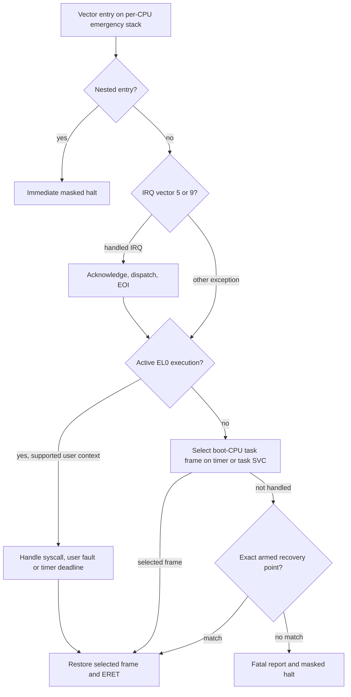

# Exception entry, diagnostics and recovery

[Handbook](README.md) · [Interrupts](interrupts-timer.md) · [Tasks](tasks.md) · [EL0](user-elf.md)

## Vector table and saved frame

[The vector table](../src/arch/aarch64/vectors.S) has sixteen 128-byte slots in a
2 KiB-aligned executable section. `VBAR_EL1` installation uses `ISB` and verifies
readback. Every CPU installs its own context and emergency-stack slot.

| Origin | Synchronous | IRQ | FIQ | SError |
| --- | --- | --- | --- | --- |
| Current EL, SP_EL0 | 0 | 1 | 2 | 3 |
| Current EL, SP_EL1 | 4 | 5 | 6 | 7 |
| Lower EL, AArch64 | 8 | 9 | 10 | 11 |
| Lower EL, AArch32 | 12 | 13 | 14 | 15 |

`ExceptionFrame` is 304 bytes, aligned to 16 bytes. Assembly offsets and C++
`static_assert` checks share [exception_offsets.h](../include/mini_os/exception_offsets.h).

| Bytes | Field |
| --- | --- |
| 0–247 | x0–x30, eight bytes per register |
| 248 | Original entry SP |
| 256 | SP_EL0 |
| 264 / 272 / 280 / 288 | ESR_EL1 / ELR_EL1 / SPSR_EL1 / FAR_EL1 |
| 296 | Vector index |

`TPIDR_EL1` identifies the owned per-CPU `ExceptionContext`.
`TPIDRRO_EL0` is reserved as entry scratch. Entry preserves x0/x1 without
touching the interrupted stack, masks D/A/I/F, checks the active marker,
switches to a 16 KiB emergency stack and captures all integer state.
Each emergency stack has a separate unmapped 4 KiB guard.

## Handler routing and return

[Open the SVG](diagrams/exception-routing.svg).

The precise routing priority is in
[mini_os_exception_handler](../src/arch/aarch64/exceptions.cpp).
An unexpected real IRQ also emits an unhandled-ID diagnostic before fatal
handling. Returning paths restore x0–x30, SP_EL0, original entry SP, ELR and SPSR.
The selected frame can belong to the interrupted task, another task, or an owned
EL1 parent returning from user execution. Restore remains masked until `ERET`.

## Fatal reports

[Pure decoding](../src/arch/aarch64/exception_decode.cpp) identifies vector
origin/type separately from synchronous syndrome. EC, IL and ISS are decoded
only for synchronous exceptions. IRQ/FIQ/SError do not treat stale ESR as their
cause. Data aborts include DFSC, translation/permission class, write direction
and FAR-valid state.

[The renderer](../src/kernel/diagnostics.cpp) begins with
`mini-os: exception vector=<origin>-<type> reason=<reason>`,
then emits syndrome, ELR, SPSR, origin-appropriate SP, raw FAR and x00–x30\nin order. EL1h uses captured entry SP; SP0/lower-AArch64 use captured SP_EL0.
Registers use sixteen hex digits, EC two and ISS seven. The terminal line is
`mini-os: halted`. FAR is explicitly raw because not every exception provides
a meaningful fault address.

Fault instructions live in [faults.S](../src/arch/aarch64/faults.S):
`brk #0x123`, permanently undefined `0x00000000`, an unmapped read at `0x1000`,
a write to an exported rodata probe, and a guarded-stack fault. Known integer
sentinels and exported instruction addresses make context checks reproducible.

## Controlled recovery and limits

Recovery is an explicitly armed, single-use EL1h fixup. It requires the exact
faulting site, syndrome, saved state and expected original stack. Only the
breakpoint/undefined probes have recovery targets. Ordinary monitor faults remain
fatal. [apply_recovery](../src/arch/aarch64/recovery.cpp) updates the return frame
only after matching; the probe then verifies registers, flags, SP and recovery
count.

An emergency stack allows the deliberate bad-SP report without storing through
the interrupted SP. This still requires intact per-CPU context, emergency-stack
memory, valid mappings and a working UART. Nested reporting faults halt without
another report. This is not general kernel-fault recovery.

Verification: [exception tests](../tests/exception_test.cpp),
[recovery tests](../tests/recovery_test.cpp), `kernel.exception`,
`kernel.mmu_fault` and `kernel.recovery`. ELF inspection verifies vector slots,
placement, stack geometry and fault-site symbols.
