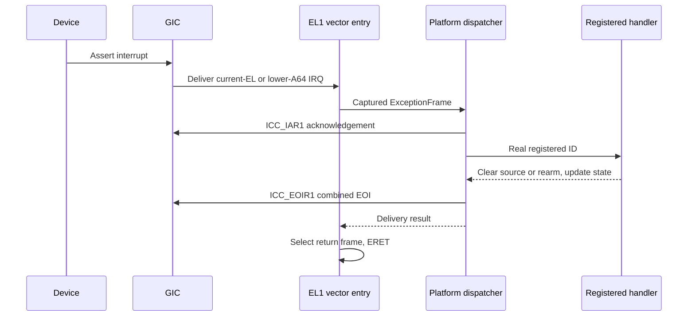
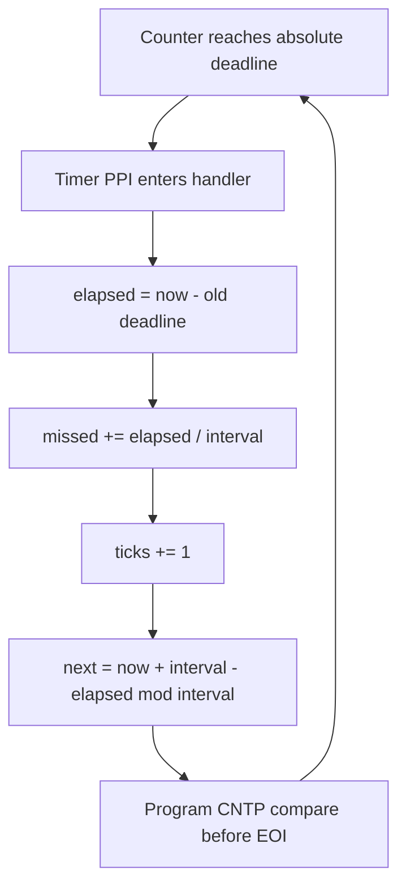

# Interrupt delivery and timekeeping

[Handbook](README.md) · [Exceptions](exceptions.md) · [Console](console.md) · [Tasks](tasks.md)

## GICv3 ownership

The [platform discovery](../src/platform/qemu_virt/gic.cpp) supplies distributor
and one redistributor region, its supported 128 KiB stride and controller phandle.\nDistributor/redistributor bases require 64 KiB alignment.
The [GICv3 driver](../src/drivers/interrupt/gicv3/gicv3.cpp) owns MMIO operations
and bounded ready polling. [AArch64 IRQ code](../src/arch/aarch64/irq.cpp) owns
`ICC_*` sysregs, IRQ masking and SGI generation.

Initialization matches the boot redistributor by affinity, enables Group 1 and
verifies the system-register interface. Combined priority drop/deactivation is
used. Unregistered sources remain disabled; normal IDs are 0–1019, constrained
further by the controller's implemented limit.

The [fixed handler table](../src/kernel/interrupt.cpp) contains 1020 slots.
Registration configures an ID, stores its callback/context and enables its source.
The context must remain live. Disabling a source does not release a live DMA
buffer or invalidate an installed callback.

## Returning boot-CPU IRQs



Architectural spurious IDs skip EOI. Unexpected real IDs are acknowledged/EOI'd,
reported and sent to fatal handling. Nesting stays disabled. Foreground D/A/F
masks remain set while IRQs are normally enabled. Local `mask_irq/restore_irq`
pairs preserve the caller's prior state; they are not global locks.

SGI 0 is reserved for the boot self-test. `irq test` verifies count changes plus
integer-register, flags and stack restoration. Secondary heartbeat SGI 1 uses
the separate masked/polled path described in [CPU/SMP](cpu-smp.md).

## Physical Generic Timer

The platform resolves the nonsecure physical PPI from an enabled
`arm,armv8-timer` node through the selected GIC. Named lists select `phys`;
unnamed lists use binding order. Conflicting interrupt descriptions and a
declared frequency disagreeing with `CNTFRQ_EL0` fail startup.

`prepare_timer` accepts 100 through `UINT32_MAX` Hz and sets

```text
interval = ceil(frequency / 100)
deadline = counter + interval
```

The architectural adapter programs `CNTP_CVAL_EL0` and `CNTP_CTL_EL0`.
The timer starts before boot confirmation. The handler updates state and rearms
before EOI, without printing or allocating.



The arithmetic is modular with comparisons limited to less than `2^63` counts
separation. Early callbacks do not advance ticks. Delayed delivery skips elapsed
periods in one calculation; it does not replay an interrupt for every missed
period. Counters saturate rather than wrap. Timer ticks signal the task adapter
and enforce the user-execution deadline.

`timer` masks IRQs briefly for a coherent frequency/interval/counter/ticks/missed
snapshot. QEMU normally reports 62,500,000 Hz and interval 625,000. Tests require
progress, not exact wall-clock timing under TCG.

## Verification

[GIC register/discovery fixtures](../tests/gic_test.cpp) cover readiness,
redistributor matching, registration, spurious IDs and malformed resources.
[Timer fixtures](../tests/timer_test.cpp) cover discovery, frequency bounds,
rounding, early/late delivery, wraparound and saturation.
`kernel.irq` and `kernel.timer` run A53 one/four-CPU and A57 one-CPU scenarios,
with serial recovery and separately registered fake-process coverage.
