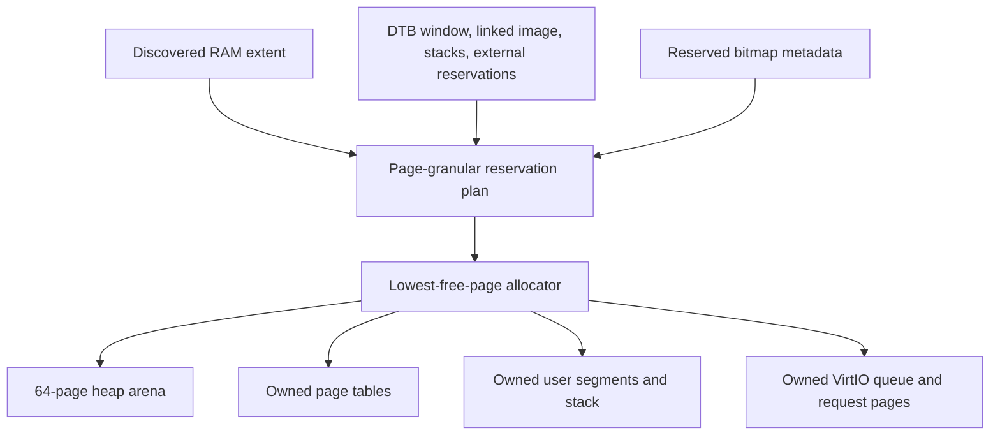
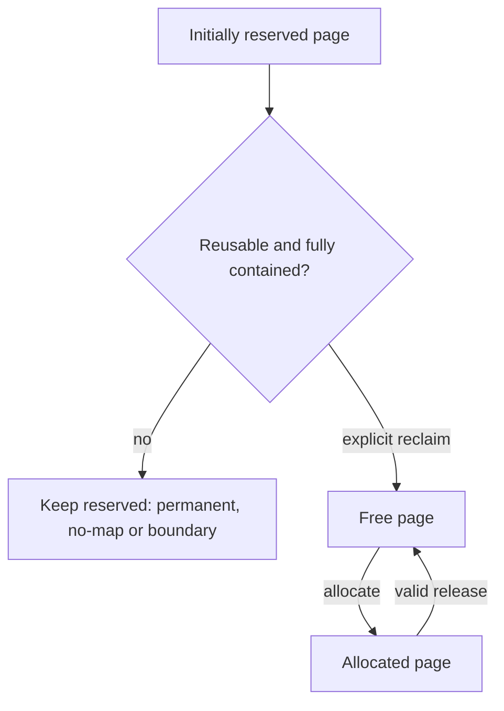
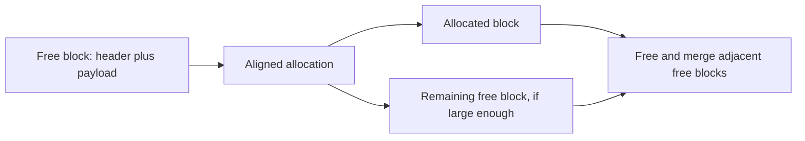

# Physical pages, reservations and heap

[Handbook](README.md) · [Virtual memory](virtual-memory.md) · [EL0/ELF](user-elf.md)

## Planning before allocation

The pure [memory planner](../src/kernel/memory.cpp) accepts one RAM extent,
a bounded reservation set and the linked DTB/image ranges. It counts complete
4 KiB pages, excludes partial boundaries, finds an aligned free interval for
bitmap metadata and validates everything before the platform writes metadata.

External reservations come from the FDT reservation table and supported static
`/reserved-memory` children. Up to 32 coalesced ranges are retained. Overlaps
merge conservatively: `no-map` survives the union, while a union containing
permanent memory cannot become reusable. Any intersecting page is reserved.

The complete image includes data/BSS and all linker-reserved guard/stack slots.
The entire `[0x40000000, 0x40200000)` DTB window and bitmap metadata also remain
reserved. Dynamic reservation requests, translated/nested buses, overflowing
ranges or external reservations conflicting with required boot memory fail startup.

## PageAllocator contract

[PageAllocator](../include/mini_os/memory.h) uses caller-provided storage for
separate reserved and allocated bitmaps. A page cannot be free and owned by
two consumers. `allocate` returns the lowest available page;
`allocate_contiguous` finds a complete free run or fails without handing out
a partial allocation.

Pages are not implicitly zeroed. Table, user-image and DMA consumers explicitly
initialize their storage before publishing it. `release` distinguishes success,
unaligned address, out-of-range address, reserved page and already-free page.

`mem reclaim` releases only complete pages fully contained in supported reusable
external ranges. Boundary pages, permanent memory and `no-map` memory remain
reserved. Repeating reclamation is harmless. It does not free the DTB blob,
kernel image, stack slots or metadata.

`MemoryStats` exposes base/size, total/reserved/allocated/free page counts and
metadata address. `mem test` allocates eight pages, writes and verifies patterns,
releases them and checks original accounting. Runtime allocation stays out of
interrupt handlers; the boot CPU is the allocator owner.

## Heap

The [platform heap adapter](../src/platform/qemu_virt/heap.cpp) reserves 64
contiguous physical pages, a 256 KiB arena. The generic
[HeapAllocator](../src/kernel/heap.cpp) uses first fit, 16-byte payload alignment
and 32-byte in-arena headers containing size, requested bytes, integrity cookie
and allocation state.

Zero-size, overflowing and exhausted requests return null. Free validates the
header chain and exact payload start; foreign/interior pointers, double frees
and corrupt headers produce explicit release errors. Coalescing merges free
neighbors in both directions. Platform heap calls briefly mask local IRQs.

There is no hosted `malloc` or global `new` integration. Heap stats distinguish
requested allocated bytes, free payload, metadata/padding overhead, blocks and
integrity. `heap test` verifies patterns, fragmented freeing, coalescing and
restored statistics.

Sources: [memory adapter](../src/platform/qemu_virt/memory.cpp),
[reservation discovery](../src/platform/qemu_virt/memory_resources.cpp).
Tests: [memory_test](../tests/memory_test.cpp), [heap_test](../tests/heap_test.cpp),
`kernel.memory` and `kernel.heap`, including malformed/reservation fixtures
under host sanitizers.
