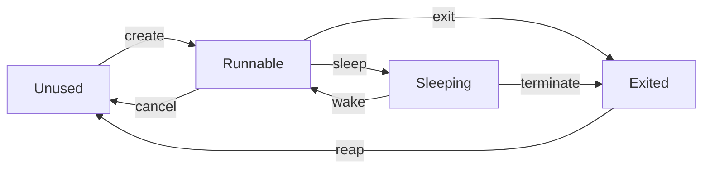
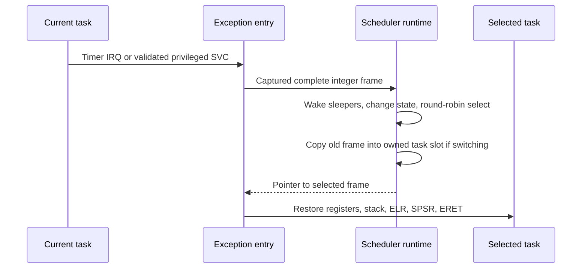

# Boot-CPU kernel tasks

[Handbook](README.md) · [Exceptions](exceptions.md) · [Timer](interrupts-timer.md)

## Policy and runtime

[SchedulerPolicy](../src/kernel/scheduler.cpp) is a pure bounded round-robin
policy with eight slots. Slot zero is the boot/monitor task and starts runnable.
Worker creation uses slots 1–7. It scans runnable slots after the current one,
wraps around, and tracks dispatches without encoding architecture registers.

[Open the SVG](diagrams/task-states.svg).

Slot zero cannot sleep, exit, cancel or be reaped through worker operations.
Cancel only applies to an undispatched noncurrent worker. Reap only applies to a
noncurrent exited worker. Modular wake deadlines require delays below `2^63`
counts. Dispatch and runtime counters saturate.

The [runtime](../src/kernel/tasks.cpp) retains an integer `ExceptionFrame`, entry
function and stack top per slot. Workers use linker-reserved 64 KiB private stacks
with unmapped 4 KiB guards. Slot zero uses the boot stack; the linker also reserves
a full eight-slot task-stack region and validates all its guards.

## Switching through exception return

[Open the SVG](diagrams/task-context-switch.svg).

Only an advanced physical-timer tick requests IRQ preemption. Ordinary UART,
VirtIO or self-SGI delivery does not independently schedule another task.
Architecture code owns frame initialization, copying, sysreg return and trap sites.

Privileged task SVCs use immediates `0x201` yield, `0x202` sleep and `0x203` exit.
[decode_task_operation](../src/arch/aarch64/task_context.cpp) requires the correct
EL1h vector/masks, exact syndrome and exported site/resume address. These are
trusted task primitives, not the EL0 syscall ABI.

Sleep requests contain a timer-period count in x0. Runtime accepts 1–10,000
periods, checks multiplication/half-range bounds and returns success in x0.
Returning from a worker entry invokes task exit. Context switching saves integer
state only; kernel compilation excludes FP/SIMD use.

## Monitor and verification

`tasks` reports runnable/sleeping/exited counts and switch/preemption/yield/sleep/
completion counters, plus the latest test outcome. It does not create arbitrary
tasks from text.

`tasks test` creates three workers. Each checks a private stack pattern, verifies
known integer registers/NZCV through yielding and timer preemption, sleeps twice,
exits and is reaped. A bounded three-second foreground budget terminates/reaps
unfinished workers. Repeating the command restores runnable/exited accounting;
it does not reclaim linker-reserved stacks into the page allocator.

The EL0 runner requires slot zero to be current with no other runnable, sleeping
or exited tasks. User execution is not scheduled as a normal kernel task.

Sources: [tasks.cpp](../src/arch/aarch64/tasks.cpp),
[tasks.S](../src/arch/aarch64/tasks.S),
[platform stacks](../src/platform/qemu_virt/tasks.cpp).
Tests: [scheduler_test](../tests/scheduler_test.cpp) and `kernel.tasks`,
including context sentinels, sleep, cleanup and subsequent monitor commands.
SMP task placement and migration remain outside this runtime.
