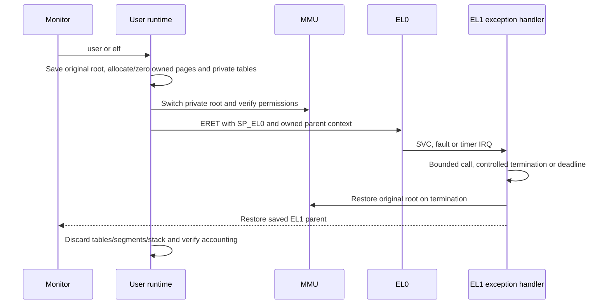
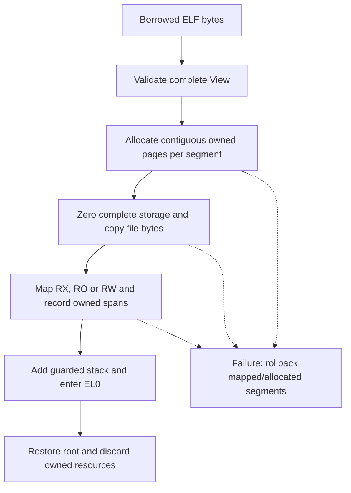

# Isolated EL0 execution and static ELF loading

[Handbook](README.md) · [Virtual memory](virtual-memory.md) · [Tasks](tasks.md)

## Owned execution context

The [user runtime](../src/kernel/user_runtime.cpp) runs one example at a time
from an idle boot/monitor task. It deep-copies the sealed kernel mapping tree into
owned disposable table pages, keeps privileged kernel/device leaves, and adds
EL0-accessible mappings for explicitly owned pages.

[Open the SVG](diagrams/user-execution.svg).

An owned EL1 parent frame supplies the return target; a damaged user stack cannot
choose the kernel return stack. `entry_sp` must match that parent context.
The original TTBR0 is restored before cleanup. Cleanup halts rather than freeing
tables that are still active.

[The architecture adapter](../src/arch/aarch64/user.cpp) checks EL0 support,
disallows EL0 DAIF manipulation, traps FP/SIMD and disables user access to timer
registers. Initial EL0t state masks D/A/F and enables IRQs. The deadline is
`CNTFRQ / 5` counts, approximately 200 ms, enforced on physical-timer IRQs.
A user fault or timeout terminates that execution and returns to the monitor;
kernel faults retain fatal behavior.

## Address and permission layout

| VA | Embedded demo use | Access |
| --- | --- | --- |
| `0x01000000` | Code page | User RX |
| `0x01001000` | Compiled ELF rodata page | User RO/NX |
| `0x01002000` | Data/BSS page | User RW/NX |
| `0x01003000` | Guard page | Unmapped |
| `0x01004000` | One-page user stack | User RW/NX |
| `0x01005000` | Initial stack top | Boundary above stack |

Physical pages come from the allocator and need not match these VAs.
[UserMemory](../src/kernel/user.cpp) retains at most eight disjoint owned spans,
rejecting overlapping VA/PA extents and writable executable regions.
Readable-span validation can cross adjacent owned regions but rejects holes
and arithmetic overflow. Syscalls resolve owned physical bytes rather than
dereferencing an unchecked user VA.

## Syscall ABI

`svc #0` with x8 as the call number is the supported EL0 ABI.
[The decoder](../src/arch/aarch64/user_context.cpp) requires the expected
lower-AArch64 synchronous context and exact SVC syndrome.

| x8 | Inputs | Result in x0 |
| --- | --- | --- |
| 1: write | x0 address, x1 length | Byte count, at most 256 bytes per call |
| 2: exit | x0 exit status | Terminates the example; no EL0 return |
| Other | Any | Unsigned encoding of `-38`, unknown call |

Oversized writes return unsigned `-22`; invalid nonempty spans return unsigned
`-14`. Zero-length writes are valid and do not increment the nonempty-write
counter. There are no file descriptors, read syscall, filesystem, signals, fork
or general process table.

`user` runs the built-in demo. `user test` additionally checks breakpoint,
undefined instruction, unmapped/readonly/kernel-access faults, a spinning
deadline case and an invalid user stack. Results retain captured context and
syscall/write/tick counts; every case verifies return and resource restoration.

## ELF parser and transactional loader

[elf::View](../src/kernel/elf.cpp) accepts bounded static ELF64 little-endian
AArch64 ET_EXEC images. Maximum image bytes: 1 MiB; loadable segments: four;
loaded pages: 64. The parser also bounds program headers to 32 records and\nsection headers to 256 records. The supported user VA policy is
`[0x01000000, 0x02000000)` excluding `[0x01003000, 0x01005000)` for guard/stack.

Validation covers header/table arithmetic, supported program/section records,
entry alignment and executable containment, file/memory sizes, address ranges,
segment/page overlap and permissions. Dynamic linkage, relocations, TLS,
runtime initialization and writable executable segments are rejected.

[Open the SVG](diagrams/elf-load-transaction.svg).

`Loaded` borrows a `LoadMemory` callback table/context until `discard`.
Each successful allocation is recorded before initialization/mapping, allowing
failure rollback in reverse ownership order. BSS, page padding and the stack
are explicitly zeroed. Private page tables are separately discarded.

## Compiled example and embedding

[User C++](../src/user/demo.cpp) verifies initialized data, zeroed BSS and stack
contents, writes `elf: user OK`, and returns 42.
[User startup](../src/user/aarch64/start.S) implements write/exit SVCs;
[its linker](../src/user/aarch64/user.ld) keeps RX/RO/RW segments in the fixed
example pages.

CMake builds `user-demo.elf` and [embed_elf.py](../scripts/embed_elf.py) emits the
exact bytes into a generated kernel rodata source. `elf` runs it once;
`elf test` runs it twice, rejects a corrupted magic header and checks restored
page/root accounting. No disk or persistent file is read by this command.

Verification: [user_test](../tests/user_test.cpp), [elf_test](../tests/elf_test.cpp),
`kernel.user`, `kernel.elf_loader` and `kernel.user_elf`. The latter
[verifier](../scripts/verify_user_elf.py) compares compiled and embedded bytes,
segment policy and entry layout. Separate fake-process modules test malformed
reports, leaks, deadlines and cleanup.
