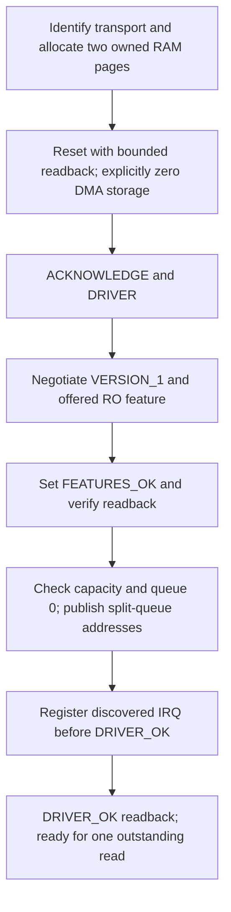
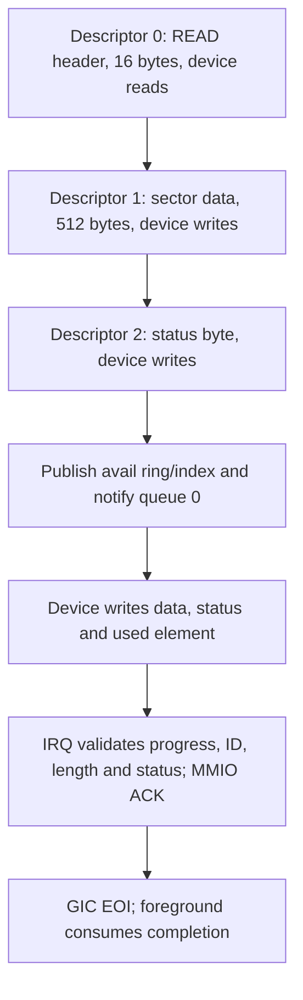

# VirtIO MMIO block I/O

[Handbook](README.md) · [Interrupts](interrupts-timer.md) · [Memory](memory.md)

## Discovery and supported devices

The [platform discovery](../src/platform/qemu_virt/virtio_resources.cpp) retains
up to 32 enabled root-level `virtio,mmio` transports. Each needs one bounded
register extent and one selected-GIC SPI, with edge-rising or level-high flags.
Duplicate ranges/IRQs, malformed cells, translated buses and IOMMU/DMA translation
are rejected. Rounded shared MMIO pages are coalesced before protected device
mapping. Decoded resources and the protected DTB window remain live.

An empty transport has device ID zero and is valid during ordinary boot.
Other device IDs are counted but have no driver. The implemented block driver
supports exactly one modern MMIO version-2 block device; attached legacy or
multiple block devices fail startup.

`virtio` reports transport/device counts and optional block base/IRQ/version,
512-byte sector capacity, RO feature, queue size, submission/completion/IRQ
counts, ready state and error. Without a block device, `virtio test` reports
unavailable. Normal `kernel-run` does not attach a disk.

## Negotiation and queue ownership

[Open the SVG](diagrams/virtio-initialization.svg).

The [driver](../src/drivers/virtio/block.cpp) receives `Resources`, an `Io`
callback table and `Dma` storage. The platform owns two explicitly zeroed,
Normal non-cacheable physical pages: one for the queue and one for the request.
Pointer alignment, physical-page identity, arithmetic and callback validity are
checked. Callback context and buffers remain valid until `stop` succeeds.

The split queue has eight 16-byte descriptors. `Queue` contains the descriptor
table, avail ring and aligned used ring, all within one page.
`Request` contains a 16-byte header, 512-byte data buffer and status at offset 528.
Capacity is read with bounded configuration-generation retries.

## Complete read path

[Open the SVG](diagrams/virtio-read-chain.svg).

Only one request is outstanding. `read` validates readiness and sector range,
prepares the three-descriptor chain, publishes it using architecture DMA barriers
and notifies the device. Used/avail counters are 16-bit with bounded modular
progress. Interrupt handling checks exactly the supported completion shape,
including descriptor ID zero and 513 bytes for a complete data/status response.

Handlers update state/counters and acknowledge MMIO before GIC EOI; they do not
allocate or print. Configuration changes are validated, including shrinkage
below a pending sector. Unsupported status/progress or reset requirements mark
the driver failed. Foreground snapshots mask IRQs for consistency.

[AArch64 DMA barriers](../src/arch/aarch64/dma.cpp) provide publish `DMB OSHST`,
consume `DMB OSHLD` and quiesce `DSB SY` ordering. Caches remain disabled;
enabling them would require a reviewed DMA/coherency design.

## Deadlines, reset and verification

Foreground reads leave IRQs enabled while polling completion and use a
half-second architectural-counter deadline. On timeout, the masked adapter
rechecks for a racing completion, then resets the device and disables its source.
DMA pages are freed only after reset completes. If quiescence cannot be proven,
the system halts while retaining ownership.

`virtio test` reads first/last sectors twice, compares repeatability and prints
FNV-1a checksums plus first/last eight bytes. Four successful reads and IRQ
deliveries must advance accounting. Successful operation retains the two DMA
pages for later requests.

`kernel.virtio` creates temporary patterned read-only raw disks, attaches modern
MMIO devices and compares exact bytes/checksums. Scenarios cover absent devices,
A53/A57, one/four/eight CPUs where specified, 128/256 MiB, varied capacities,
later monitor/allocator/EL0 operations and explicit legacy rejection. Backing bytes
must remain unchanged.

Sources: [driver API](../include/mini_os/drivers/virtio.h),
[platform lifetime](../src/platform/qemu_virt/virtio.cpp),
[pure renderer/checksum](../src/kernel/virtio.cpp).
Tests: [virtio_test](../tests/virtio_test.cpp),
[fake runner](../tests/python/test_virtio_runner.py).
Writes, filesystems, indirect/packed queues, multiple outstanding requests and
IOMMU support are not implemented.
