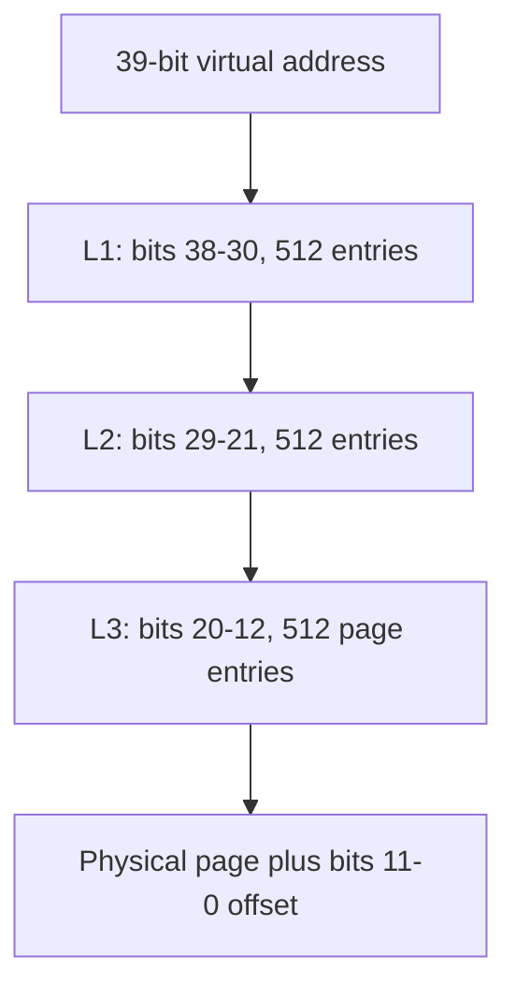
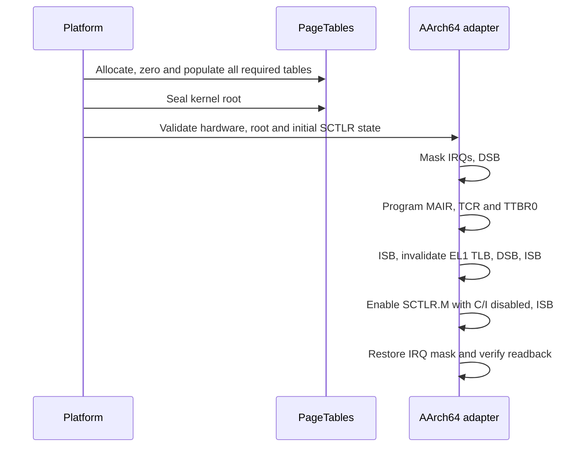

# Protected virtual memory

[Handbook](README.md) · [Physical memory](memory.md) · [EL0/ELF](user-elf.md)

## Translation configuration

The kernel uses 4 KiB pages, a 39-bit TTBR0 VA space and a 40-bit physical-address
configuration. TTBR1 walks are disabled. Hardware must support the chosen physical
width and 4 KiB granule. `supports_mmu` validates the relevant MMFR0 fields;
unsupported encodings fail startup.

[Open the SVG](diagrams/page-table-walk.svg).

[PageTables](../src/arch/aarch64/page_tables.cpp) borrows a `TableMemory` callback
table for page allocation, physical access and release. It zeroes all 512 entries
of each owned table page. `map` installs identity mappings; `map_at` supports
different VA/PA pairs. Existing mappings, invalid alignment, out-of-range
addresses, `no-map` input and writable/executable permission combinations are
rejected through the supported mapping kinds.

`seal` prevents further additions and discarding of the live immutable kernel
root. A failed partially built disposable tree must be discarded by its owner;
mapping failure is not a promise of per-call rollback. `initialize_copy` deep-copies
table pages while preserving mapped physical leaf addresses and permissions.

## Permission policy

The [platform mapping builder](../src/platform/qemu_virt/mappings.cpp) validates
layout and reserved ranges before mapping them.

| Region | EL1 access | Execution | Attribute |
| --- | --- | --- | --- |
| Kernel text and vectors | Read | EL1 executable | Normal non-cacheable |
| Kernel rodata and DTB window | Read | None | Normal non-cacheable |
| Data, BSS, writable RAM, metadata, tables and stacks | Read/write | None | Normal non-cacheable |
| UART, distributor, redistributors, coalesced VirtIO pages | Read/write | None | Device-nGnRnE |
| Null, unassigned addresses, guards, `no-map` reservations | Unmapped | None | No descriptor |

All kernel identity leaves deny EL0 access. User roots preserve these privileged
leaves and add owned EL0 RX, RO and RW/NX mappings. Kernel aliases of owned RAM
remain privileged and non-executable; this is not an adversarial kernel-isolation
design.

Devices are rounded to complete pages. A device mapping cannot overlap RAM,
a `no-map` page or incompatible device pages. Multiple VirtIO slots sharing
a page are coalesced before mapping. Guard holes cover the boot stack and each
exception, secondary and task stack slot.

## Activation and root changes

[Open the SVG](diagrams/mmu-activation.svg).

[arch/mmu.cpp](../src/arch/aarch64/mmu.cpp) owns barriers, TLB maintenance,
`AT` translation instructions and sysreg writes. `switch_address_space` uses
the same masked ordering for disposable user roots and flushes the EL1 TLB.
The original root must be active again before user tables or segments are freed.

Caches remain disabled. Kernel mappings are immutable after activation;
dynamic remapping, cache maintenance for enabled caches and general ASID/process
management are outside the implementation.

## Probes and verification

`mmu` reports SCTLR/TCR/TTBR0/MAIR and owned table count. Architectural probes
verify identity translation, denied text/rodata/DTB writes, writable stack/UART,
and unmapped null/guards. EL0 setup separately checks user-access permissions.

[mmu_test.cpp](../tests/mmu_test.cpp) covers descriptors, deep copying, overlaps,
boundaries, unsupported hardware, exclusions, exhaustion and cleanup.
`kernel.mmu` covers normal operations across CPU/RAM scenarios.
`kernel.mmu_fault` checks exact translation/write-permission fault sites and FAR.
They have separate ten-second runner and twenty-second CTest deadlines.
